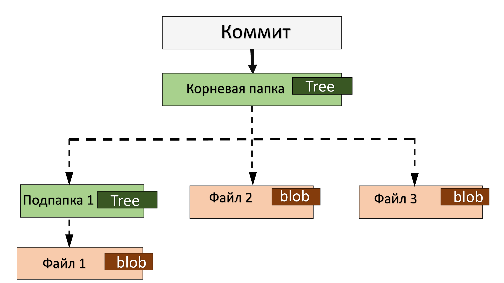

## Строение Git

Все принадлежащие гиту файлы проходят через несколько областей:  
1. Рабочая директория (**working directory**);
2. Область/стадия подготовленных файлов или индекс (**staging area**, "стейджинг-зона");
3. Каталог Git (.**git directory**).

 

**Рабочая директория (working directory)** — это рабочая копия определенной версии нашего проекта, сжатая база данных.  
Здесь находятся файлы, с которыми мы напрямую работаем. Как только мы что-то изменили в этих файлах — изменится  
состояние рабочего каталога (working directory).

**Стадия подготовленных файлов (staging area, индекс)** — это специальная промежуточная область, которую отделяют логически.  
Сюда добавляются файлы, которые будут переданы в каталог Git для отслеживания их версий. В **Staging area** хранятся те  
данные, которые Гит должен будет сохранить (они пойдут в коммит). Это некое среднее состояние между Working Directory и  
.git directory — изменения уже на пути к фиксации, но еще не сохранены в базе Git.  

(Технически **Staging area/Индекс** — это всего лишь файл.)

**Каталог Git (.git directory)** — локальный репозиторий Git — папка .git, в которой Git хранит все объекты и данные нашего  
проекта (и их версии): код, изображения, скрипты, стили. Это хранилище файлов, которые сначала были добавлены в Staging  
area и для них был сделан коммит.

Также здесь Гит хранит свои служебные файлы:

- настройки файла конфигурации репозитория,
- журналы, хранящие операции над репозиторием,
- стадия подготовленных файлов (индекс) — сам файл.

### Перемещение изменений в файлах между областями

 

Изначально мы находимся в рабочей директории **(working directory)**. Это может быть копия версии проекта, склонированная с  
удаленного репозитория, которая находится теперь у нас на жестком диске компьютера. Или это может быть созданный нами  
репозиторий. Суть в том, что это рабочая **директория/каталог**. Здесь мы будем производить все действия по редактированию  
файлов: переписывать код, менять шрифты, цвета, добавлять новые блоки и функции, удалять старые и т.д. В общем, меняем тут  
какие-то файлы, добавляем новые, какие-то удаляем — совершаем те действия/изменения, которые потом хотим сохранить в Git.  

Отредактировали файлы и хотим сохранить эти изменения. Мы не можем напрямую положить их в базу Гита, сначала надо  
переместить изменения в промежуточную область — в Staging area (индекс) — так мы показываем гиту, что эти изменения важны  
и их надо сохранить:  

 

"**Stage Fixes**" - Подготовить изменения.  

Добавили изменения в **Staging area**, и теперь необходимо сохранить их в базу Git  — сделать коммит. Мы можем и не делать  
коммит сразу, а поработать еще с файлами в **working directory** и опять добавить их в Индекс. В Индексе собираются  
изменения, которые мы хотим когда-нибудь отправить в коммит.  

Когда мы убедились, что изменения в Индексе хотим сохранить в Git — сделаем коммит:  

 

"**commit**" — Закоммитить.

Как только мы сделали коммит, изменения в сжатом виде попадают в каталог Git (.git directory) и надежно хранятся в папке  
.git.  

Мы храним изменения в Git для того, чтобы ими когда-нибудь воспользоваться. Поэтому есть команда **checkout**, которая  
позволяет вытащить изменения из каталога Git обратно в рабочую директорию:  

 

В этом и заключается основная задача Git: мы что-то делаем, изменяем и сохраняем все в Гите для того, чтобы когда-нибудь  
мы смогли вытащить обратно в рабочий каталог какую-то из предыдущих версий проекта и работать в ней.

### Состояния (статусы) файлов

Из-за того, что файлы перемещаются по этим трем областям (**working directory**, **staging area** и **.git directory**),  
они могут иметь разные состояния:  

1. **Неотслеживаемые файлы** (**Untracked**) — это все те файлы в нашем рабочем каталоге, о которых Гит ничего не знает.  
Эти файлы не входили в последний коммит и не подготовлены к коммиту.  Когда мы создаем новый репозиторий, Гит ничего  
не хранит, никакие файлы в нем не отслеживает. То же самое с каждым новым файлом в репозитории — Гит не может сразу их  
автоматически подхватить, он просто скажет нам, что видит файлы, но не следит за ними (не хранит их). Для того, чтобы  
Гит их хранил, мы должны их проиндексировать — добавить в **Staging area**.  
2. **Отслеживаемые файлы** (**tracked**)— это те файлы, о существовании которых гит знает — они находятся под версионным  
контролем. Когда мы впервые клонируем репозиторий, все файлы в нем будут отслеживаемыми и неизмененными, потому что Git  
только что их извлек, и мы ничего пока не редактировали.  
3. **Измененный** (**Modified**) — как только мы изменим какой-то файл, Git будет рассматривать его как измененный.  
4. **Индексированный** (**Staged**) — добавленный под версионный контроль гита, помещенный в **Staging area**. В этом статусе  
файл готов к отправке в репозиторий (готов коммиту). Такие файлы находятся уже на пути к фиксации изменений в них, но  
пока эти изменения не сохранены в базе Git. Файлы будут находиться здесь до тех пор, пока мы не сохраним их (не зафиксируем).  
5. **Зафиксированный** (**Сommitted**) — сохраненный в локальном хранилище, закоммиченный файл, готовый к отправке в  
удаленный репозиторий. Коммитим файл тогда, когда мы уверены, что все изменения, которые мы добавили в **Staging area**,  
необходимо сохранить в базу Git. Они в сжатом виде помещаются в Каталог Git.

Подробнее в главе 3.
___
### Внутреннее устройство Git. Объекты.

Всю информацию Git структурирует и хранит в виде своих "объектов". Это специальные файлы, которые содержат определенную  
информацию о репозитории и его файлах. Все объекты хранятся в папке .git/objects/  и относятся одному из 4-х разных  
типов: "**блоб**", "**дерево**", "**коммит**" или "**таг**".  

1. "**Блоб**" (**blob**) используется для хранения содержимого файла, обычно это большой бинарный файл типа:   
`703ec79a98c1d097d5b1cd320befffa376e826`  
**Блоб** — это начальное представление данных в Git — один файл на единицу хранения. Он _**формируется для каждого файла**_ в  
репозитории, когда мы добавляем файл в Индекс. Его задача — хранить снимок содержимого файла.   
Если мы просто изменили файл, то Гит еще не начинает его хранить. Но как только мы переводим этот файл в область  
Индекса — вот с этого момента Гит начинает хранить информацию об этом файле.  
Во время добавления файлов в **Индекс** Git делает следующее:    
    - сжимает содержимое этих файлов и создает _**блоб-объекты**_;   
    - помещает имя этого объекта в файл **_Индекса_** (помним, что технически **_Индекс_** — это всего лишь файл).   
_**Blob-объекты**_ отличаются от файлов тем, что файлы содержат метаданные (например, свое название, информацию о времени  
создания и другие). Если мы перенесем файл из одной папки в другую, эти метаданные не меняются. А _**блоб**_ — это само  
содержимое, представленное в виде бинарных строк данных. Он не хранит ни времени своего создания, ни свое имя, ни любой  
другой информации кроме собственного содержания.  
2. _**Дерево (tree)**_ - эквивалент директории. Блобы создаются для файлов, а деревья выходят на следующий уровень: они  
показывают связи между файлами. _**Для каждой папки**_ репозитория во время коммита создается свой _**tree-объект**_.   
_**Объект-дерево**_ содержит одну или более записей, указывающей на другое дерево или blob, группу других деревьев или  
блобов. Он показывает, какие файлы и папки лежат в каждой папке репозитория. 
_**Объект-дерево**_ формируется для каждой папки репозитория во время коммита.  
Нужно понимать, что: 
   - _**blob-объекты**_ хранят информацию о файлах репозитория и их содержимом;  
   - _**tree-объекты**_ хранят информацию о расположении этих файлов в репозитории.  

3. _**Объект коммита**_ - это объект, который содержит информацию о текущем коммите. Он выполняет следующие задачи:    
   - указывает на главное дерево (которое содержит корневую папку проекта), фиксируя в истории каким образом оно  
      выглядит в момент выполнения коммита;   
   - содержит и мета информацию: кто автора коммита, сообщение и время коммита.   
В большинстве случаев коммит также содержит родительские коммиты – предыдущий снэпшот/снэпшоты.   
_**Объект коммита**_, как и объект-дерево формируется во время коммита.     
   
4. "_**Таг**_" (_**tag**_) — это способ маркировать определенный коммит как специфический, чтобы впоследствии было легче  
его найти. Маркировать — значит дать какое-либо легко запоминающееся имя.  

Почти все в Git построено вокруг манипуляций этой простой структурой, состоящей из четырех различных объектов. И если мы  
на время забудем о кодовых репозиториях Git, а вместо этого представим Git как систему, которая поддерживает файловую  
организацию, то нам будет проще понять Git. Это что-то вроде своеобразной системы, надстроенной над файловой системой  
компьютера, и ее задача — сделать снимок (снэпшот, коммит) файловой системы в определенные моменты времени.  

**Итог:**  

Файловая система начинается с корневой папки (директории), которая обозначается слэшем:

`/`  

Она содержит в себе файлы и другие папки, которые в свою очередь содержат в себе разные папки и файлы. Внутри Git  
содержимое файлов хранится в blob-объектах. Объекты деревья показывают связи между файлами в репозитории. А коммит  
фиксирует в истории проекта как выглядит главное дерево в момент выполнения коммита.  

Таким образом, хранение данных репозитория в Git выстроено следующим образом:  

 

В объекте коммита хранится tree-объект, который указывает на главное дерево - Корневую папку. Для того, чтобы указывать  
на репозиторий, коммит должен указывать именно на корневую папку репозитория.  

Для самой **Корневой папки** создается объект-дерево, в котором будут перечисляться все компоненты, которые есть в папке:  
1. Вложенный объект-дерево для Подпапки 1;
2. Блоб для Файла 2;
3. Блоб для Файла 3.

Для Подпапки 1 тоже создастся свой tree-объект, внутри которого лежт блоб-объект для **Файла 1**.  
___
