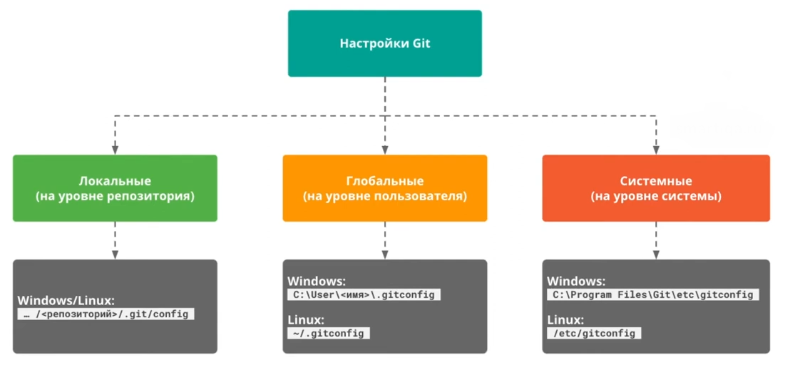

Предполагается что гит уже установлен в системе, поэтому идем сразу в настройки.

## Настройки Git

Настройки бывают трех видов: системные, глобальные и локальные.

Системные настройки (на уровне системы) распространяются на всех пользователей, файл с такими настройками хранится в:  
- `C:\Program Files\Git\etc\gitconfig` для **Windows**;
- `/etc/gitconfig` для **Linux/MacOS**.  

**Глобальные настройки** (на уровне пользователя) применяются конкретно **для одного пользователя (нас)** и одинаковы для всех  
репозиториев, созданных конкретно нами. Файл с ними хранится в **C:\User\<имя пользователя>\.gitconfig** в **Windows** и в **~  
/.gitconfig** для **Linux/MacOS**.  

**Локальные настройки** (на уровне отдельного репозитория) не применяются к другим нашим проектам. Они лежат в самом  
репозитории в файлике **config** по адресу:  

**.../<репозиторий>/.git/config (для Windows, Linux и MacOS)**

Изменить настройки Git можно, но не рекомендуется трогать системные настройки. Менять можно глобально и локально, нужно  
будет отредактировать файл **.gitconfig** (глобально, для всех наших репозиториев настройки будут одинаковыми) или  
**.git/config** (локально, если хотим, чтобы отдельные репозитории имели свои какие-то настройки) в текстовом редакторе.  

