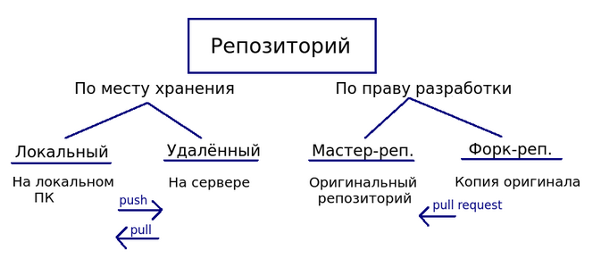
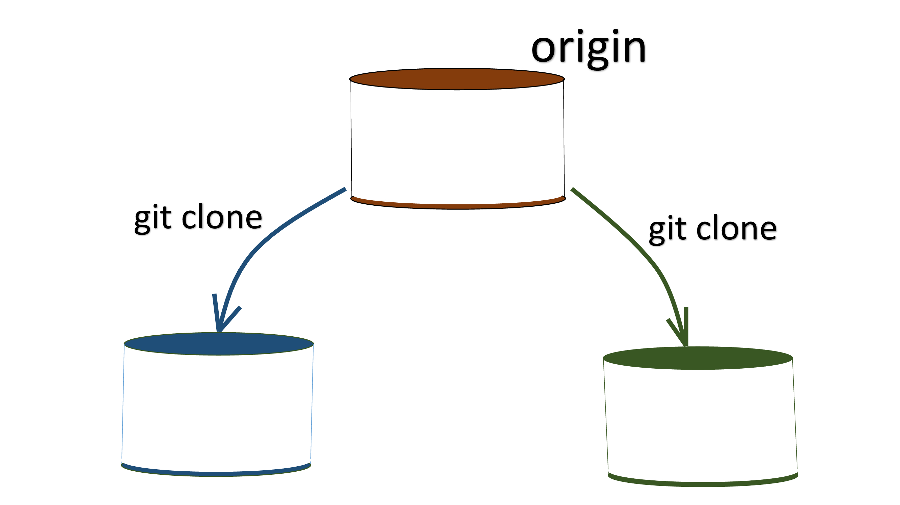
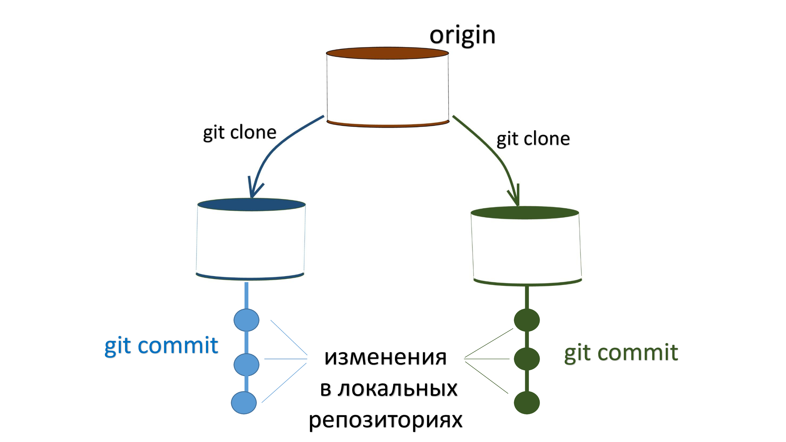
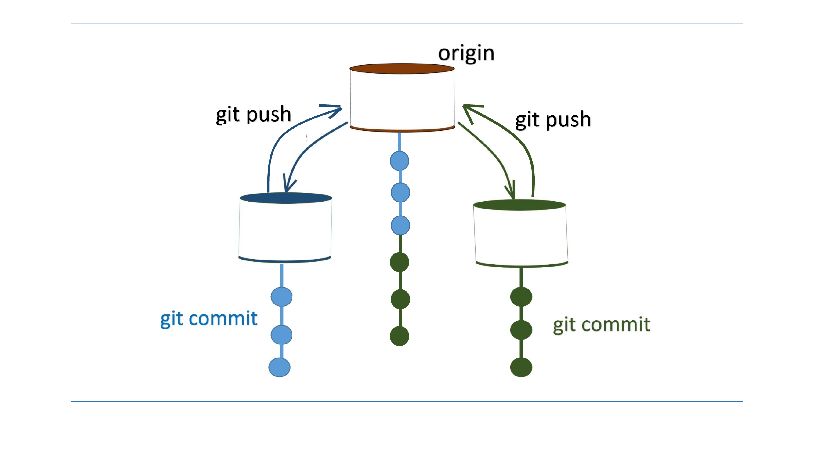
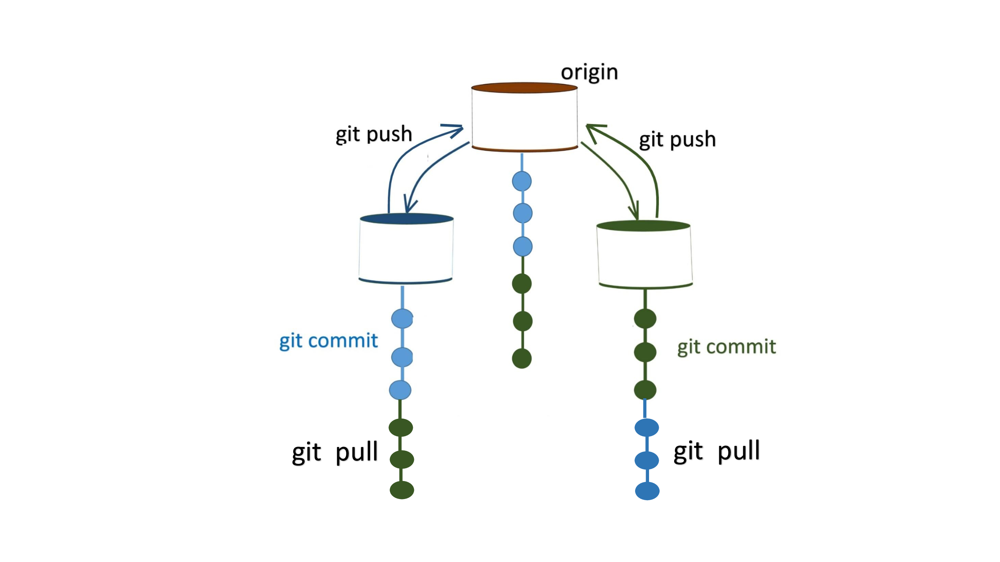
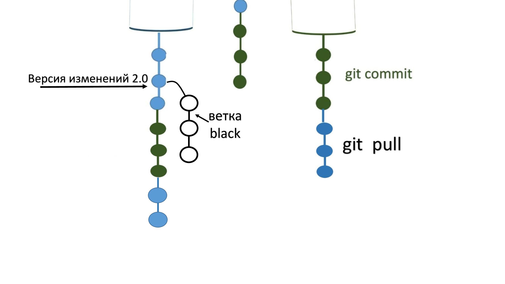
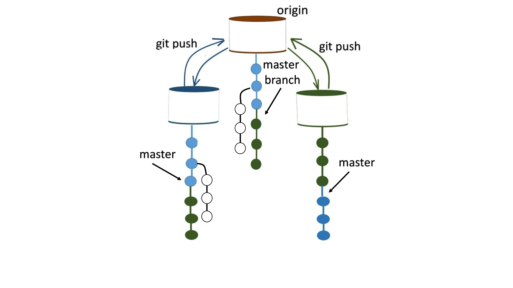
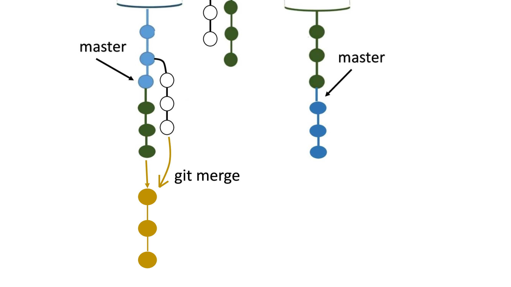

## Что такое Git?

**Git** – это инструмент, который позволяет сразу нескольким людям сохранять и отслеживать изменения в проекте. Очень  
важная и очень крутая штука.

**Git** относится к распределенными системам контроля версий: имеет **репозиторий** не только на сервере, но и локально  
на компьютерах разработчиков.  
**Репозиторий** представляет собой каталог файловой системы, в котором находятся файлы конфигурации репозитория, файлы  
журналов, хранящие операции, выполняемые над репозиторием, индекс, описывающий расположение файлов, и хранилище этих  
файлов. А если попроще, то **репозиторий** – это хранилище данных.  

Когда у нас есть **Git**, мы можем отслеживать изменения вообще любых файлов на нашем компьютере. А когда мы работаем в  
команде над одним и тем же проектом и меняем одни и те же файлы, то, согласитесь, очень важно знать, кто и когда что-то  
там изменил. Это тоже можно сделать с помощью **Git**.  

Часто бывает и так, что внесенное в код исправление ломает работающие части проекта, и даже после отмены этого  
исправления ситуация не улучшается.  

**Git** и здесь может быстро откатить проект до рабочего состояния (к той стабильной версии, которая была до  
возникновения ошибок), пока программисты будут жестко потеть, выискивая проблему и не боясь навредить работе проекта в целом.  

Поэтому изначально при разработке какого-то проекта рекомендуется пользоваться Git: взять все файлы, относящиеся к проекту,  
и поместить под контроль **Git**. **Как только мы это сделаем, он будет следить за всеми изменениями внутри этих файлов**:  
на каких строчках они произошли, что на что поменялось, когда это поменялось, кто поменял и многое другое. И когда при  
дальнейшей разработке возникнет какая-то проблема, мешающая или ломающая код, то мы просто обращаемся к **Git** и он  
возвращает все файлы в состояние стабильной версии. Кроме того, что **Git** все вернет, он еще и сохранит внутри себя  
нестабильную версию (с проблемой или поломкой), не удалит ее. Мы сможем вернуться в нее и разбираться, в чем был затык.  

### Возможности Git:

1. Хранить, обрабатывать и передавать данные: можем работать с контентом
2. Поддерживать рабочую версию и параллельно создавать новые версии, одной командой сливать их воедино или разделять.
3. Контролировать изменения проекта: **Git** создает свою базу изменений, и мы можем в любой момент откатиться в прошлое  
до поломки кода.
4. Вести параллельную разработку: одни и те же объекты можем редактировать как мы, так и другие участники команды, причем  
никаких конфликтов при этом не будет. Ведь каждый хранит свои правки в локальном репозитории на своем компьютере. Они не  
вступят в силу, пока мы их не выгрузим на сервер и не сольем с основной версией.

От других систем **Git** отличается особым подходом к обработке информации: он не записывает отдельно внесенные правки, а 
делает подробный снимок проекта (snapshot) в момент сохранения. Он фиксирует состояние каждого файла, и создает ссылку  
на эту версию.

## Как работает Git?

### Немного терминов:
1. **Репозиторий (repository)** – хранилище данных. Это общее название папки с файлами, за которой у нас на компьютере  
следит Git, и придумано это слово для удобства, чтобы не говорить "папка с проектом". Репозиториев на нашем компьютере  
может быть сколь угодно много. Например, папка с проектом – это один репозиторий, папка с фото – другой, и т.д. Все они  
автоматически будут находиться под контролем Git, когда мы его подключим, и любое изменение любого файла в репозитории  
будет автоматически запоминаться и отслеживаться гитом.  
Виды репозиториев: 
   * **По месту хранения** репозиторий бывает **локальный** и **удаленный**.
        * **Локальный (local repository)** – это та папка с файлами, которая хранится на нашем компьютере, за которой следит гит.
        * **Удаленный (remote repository)** – это тот самый локальный репозиторий, который у нас был на компьютере и  
      который мы с помощью Git загрузим на удаленный сервер, например, GitHub. Удаленный репозиторий создается на основе  
      локального и по сути является копией локального, только находящейся где-то в облаке – удаленно.  

   * __По праву разработки__ репозиторий бывает __мастер-репозиторий__ и __форк-репозиторий__.
        * __Мастер-репозиторий__ – это оригинальный репозиторий, общий для всей команды репозиторий с рабочей версией  
     проекта. Исходный. Слово "мастер" это всего лишь соглашение между людьми, оно не имеет никакого технического смысла. 
     Вносить изменения в него можно только с согласия автора, которому сначала нужно отправить __pull request (пул  
     реквест)__ — предложение со своими изменениями, чтобы он залил их в исходный репозиторий.
        * __Форк-репозиторий__ – копия оригинала, которым управляем уже мы. __Форки__ позволяют вносить изменения в проект, не  
      затрагивая исходный репозиторий. Это полная копия мастер-репозитория, в которой мы можем безопасно работать.

 

2. **Коммит (commit)**  имеет 2 значения:
   * зафиксированное состояние проекта в определенный момент времени (контрольная точка, снимок);
   * конкретная версия репозитория.

3. **Ветка (брэнч, бранч, бранча – кому как нравится)** – альтернативная реальность кода, история которого начинается от  
конкретного коммита. 
4. **Master branch** – главная ветка, "золотая" ветка, содержащая эталонный код. Ее также называют **origin master**.

### Как все происходит:

Под проект создается удаленный репозиторий, который обычно называется **origin**. Он находится на сервере и является  
главным хранилищем всех данных нашего проекта. С него участники проекта (разработчики, тестировщики, дизайнеры и т.д.)  
делают копии к себе на локальные компьютеры с помощью определенной команды – `git clone`. Выражение "склонировать  
репозиторий" означает создать копию к себе на компьютер.  

 

Итак, мы склонировали репозиторий к себе на компьютер, теперь у нас имеется свой локальный репозиторий – это точная  
копия/клон удаленного.  

Удаленный репозиторий (который на сервере) содержит **master branch (origin master)** – основную ветку с кодом нашего проекта.  
Когда создается репозиторий, автоматически создается первая ветка. В ней хранится эталонный код, а саму ветку еще называют  
"золотой". Клонируя репозиторий к себе на локальный компьютер, мы клонируем как раз эту "золотую" ветку и в этой  
склонированной ветке мы и будем в дальнейшем работать. Этот "клон" тоже будет называться **master** (от этого слова в  
последнее время массово отказываются, переходя на **main**), но работаем и вносим изменения мы уже именно в нем, в  
локальной ветке. Золотую ветку (**master branch**) в удаленном репозитории мы вообще не трогаем.  

Далее каждый разработчик в свою копию вносит какие-то изменения и фиксирует их с помощью команды `git commit` – коммитит их.  

 

Если разработчики хотят обменяться своим кодом, они могут сделать это через удаленный репозиторий. Сначала они зафиксируют  
изменения в своих репозиториях (“закоммитят”, каждое изменение оформят в виде коммита), потом передадут их на сервер с  
помощью команды `git push` (“пушат” свои изменения). Эта команда передает изменения в удаленный репозиторий, и в его  
истории появятся коммиты:  

  

На удаленном репозитории в master branch встраиваются эти коммиты, ветка растет. В ней сохраняются и наши изменения  
(коммиты) и изменения других разработчиков, которые тоже закоммитили и запушили их в удаленный репозиторий.  

Для того чтобы нам получить их изменения (ведь в локальной ветке мы имеем только свои изменения), а им наши (у них пока  
только их изменения. Они – это другие разработчики на проекте), достаточно дать гиту команду `git pull`:  

   

С помощью `git pull` мы "стянем" к себе все, что есть в удаленном репозитории: всю **origin master** целиком с нашими изменениями  
и изменениями других разработчиков. Наша **master** (ветка на локальном компьютере, main-ветка) автоматически обновится до  
состояния **master branch**.  

Кроме **master (main)** есть и другие ветки. **Ветка** – это альтернативный путь развития проекта, по сути изменение к  
какому-то коммиту или разная последовательность коммитов. От любого коммита на **master** можно создать другую ветку и  
работать отдельно в ней, а потом соединить с **master**. Или удалить, если не понадобится.  

Ветка всегда имеет свое имя, оно необходимо для ориентирования по веткам. Назовем нашу ветку **black**:  

   

Опираясь на версию изменений 2.0, с помощью ветки black мы создаем альтернативную историю изменений. Таким образом, у нас  
есть наша локальная ветка **master** (та, которую мы склонировали с удаленного репозитория с "золотой" ветки **master branch**)  
и альтернативная ветка **black**. Можем работать и в одной и в другой, продолжать вносить изменения в наш локальный  
репозиторий на локальную ветку **master** и при этом отдельно работать с альтернативной веткой **black**.  И если мы захотим  
поделиться/обменяться веткой **black** (теми изменениями, которые на ней сделали) с сервером – тоже "запушим" ее, указав в  
команде `git push` ее название (**black**).

Мы можем поместить наши изменения в ветке **black** на какую-то конкретную ветку на сервере, которая будет "выращена" от того  
же самого коммита на золотой ветке, от которого она была выращена в нашей локальной копии. На рисунке от главной ветки **master**  
мы отделили другую ветку, потом все отправили в удаленный репозиторий, где на главной ветке **master branch** тоже появилась  
ветка с того же самого коммита:

   

Допустим, те изменения, что мы сделали на ветке **black**, нам понравились и мы хотим добавить все это к нашей локальной ветке **master**.  
В таком случае делаем новую ревизию и "вливаем" изменения между двумя ветками: в **master** вольем изменения, которые имеем в ветке **black**.  
И дальше можем продолжать историю. Сама операция "слияния" веток выполняется с помощью команды `git merge` и называется "смёрживание":  

   

Можем работать дальше. Это и есть основной процесс работы с гитом.  

По итогу алгоритм следующий:

1. Создаем у себя копию удаленного репозитория с копией золотой ветки проекта
2. Начинаем работать в этой копии (на локальной ветке). Пишем код, изменяем его.
3. Фиксируем (коммитим) все, что сделали. Если хотим поделиться нашим творением – пушим его на удаленный репозиторий.  
Если не хотим – не пушим. Закрыли все, выключили компьютер.  
4. Решили снова поработать – сначала обновляем нашу локальную ветку до состояния **master branch**. Для этого командой  
`git pull` стягиваем к себе все, что другие запушили в удаленный репозиторий. Наши творения никуда не денутся, они так же  
лежат на нашей локальной ветке, можем продолжать с ними работать, не забывая коммитить. 
5. Если нам нужно разработать какой-то новый функционал, то создаем новую ветку под него и работаем в ней. Поработали,  
закоммитили, посмотрели, что у нас есть две ветки, одна из которых (main) является условно основной. Переключаемся на  
нее и добавляем этот функционал (делаем слияние веток)

### P.S.

**master branch = origin master** = главная ветка удаленного репозитория

**master = main** = локальная копия главной ветки

`git clone` – склонировать копию удаленного репозитория к себе на компьютер

`git commit` – зафиксировать/сохранить изменения у себя в локальном репозитории

`git push` – передать сохраненные изменения в удаленный репозиторий

`git pull `– получить новые изменения с удаленного репозитория

`git merge` – перенести изменения с переданной ветки в текущую

