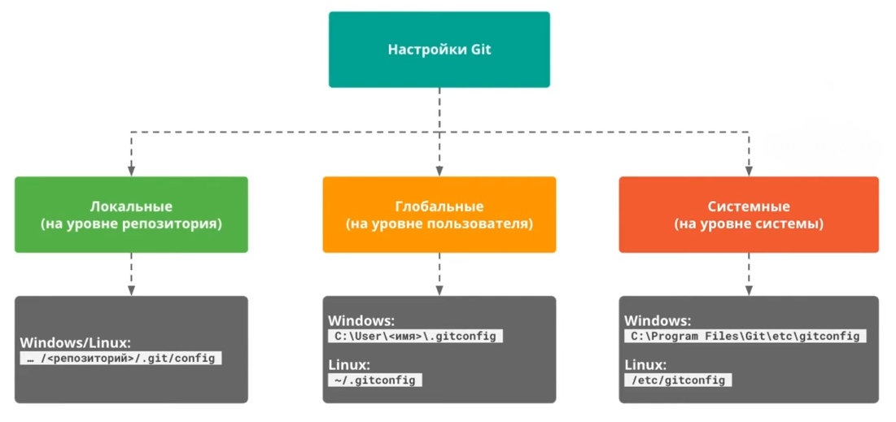

Предполагается что гит уже установлен в системе, поэтому идем сразу в настройки.

## Настройки Git

Настройки бывают трех видов: системные, глобальные и локальные.



Системные настройки (на уровне системы) распространяются на всех пользователей, файл с такими настройками хранится в:  
- `C:\Program Files\Git\etc\gitconfig` для **Windows**;
- `/etc/gitconfig` для **Linux/MacOS**.  

**Глобальные настройки** (на уровне пользователя) применяются конкретно **для одного пользователя (нас)** и одинаковы для всех  
репозиториев, созданных конкретно нами. Файл с ними хранится в **C:\User\<имя пользователя>\.gitconfig** в **Windows** и в **~  
/.gitconfig** для **Linux/MacOS**.  

**Локальные настройки** (на уровне отдельного репозитория) не применяются к другим нашим проектам. Они лежат в самом  
репозитории в файлике **config** по адресу:  

**.../<репозиторий>/.git/config (для Windows, Linux и MacOS)**

Изменить настройки Git можно, но не рекомендуется трогать системные настройки. Менять можно глобально и локально, нужно  
будет отредактировать файл **.gitconfig** (глобально, для всех наших репозиториев настройки будут одинаковыми) или  
**.git/config** (локально, если хотим, чтобы отдельные репозитории имели свои какие-то настройки) в текстовом редакторе.  

### Файл с настройками Git  

Системные настройки лежат в файле, который называется **gitconfig**

Глобальные – в файле **.gitconfig**

Локальные – в файле config, который лежит в папке **.git (.git/config)**

Файл с настройками представляет собой обычный файл с параметрами (переменными и их значениями). Важными для нас  
являются 2 параметра: **имя** и **email**. После того, как мы установили Git, надо эти 2 параметра настроить (сконфигурировать).  

### Конфигурация Git

Параметры можно настроить 2 способами:  

1. вручную, перейти в файл .gitconfig напрямую и изменить его в текстовом редакторе. Вариант неплохой, но можно где-то  
опечататься/ошибиться, поэтому лучше использовать утилиту `git config`.<br><br>  
2. с помощью утилиты `git config`, которая указывает конфигурацию для Git – как мы с ним будем работать. Ее надо вызвать  
и передать ключ (`--global` или `--system`), так как по дефолту будет ключ `--local` (т.е. настройки будут применены  
локально, для конкретного репозитория):<br><br>    
    - `git config --global` – так мы будем изменять настройки на глобальном уровне – уровне пользователя, а не конкретно  
    для какого-то репозитория. Если мы хотим задать настройки для отдельных репозиториев — переходим в них и запускаем  
    команду без `--global`.<br><br>  
    - `git config --system` – так мы можем изменить настройки на уровне системы, но делать этого мы не станем.<br><br>  
   
   После указания ключа мы должны будем прописать для параметров их названия и значения. Названия параметров будут:  <br><br>

    - `user.name` – **имя пользователя**;
    - `user.email` - **email пользователя**.

### Пример настройки конфигурации на Windows

В терминале вводим все те же самые команды:  
1. `git config --global user.name имя_фамилия` – указываем свое имя;<br>  
`--global` чтобы эти настройки применялись вообще к любому файлу, который мы отдадим под контроль гита.  
2. `git config --global user.email ваш_email` – прописываем имейл.  

  

Эти настройки сохраняются в файлик `.gitconfig`. Теперь Git запомнил эти настройки и будет применять их к любым файлам,  
которые мы будем менять. В дальнейшем, когда мы будем что-то добавлять/удалять, то именно под этим именем и с этим  
имейлом мы будем известны в истории изменений того или иного файла.  

Посмотреть имя и имейл можно командой `git config --list --global`:

```commandline
> git config --list --global
user.name=Kot Bantik
user.email=supercat@vv.com
```

### P.S.  

`git config` – читает/меняет текущую конфигурацию Git на компьютере

`git config --global user.name "Kot Bantik"` – настройки имени будут применяться вообще к любому файлу, который мы отдадим под контроль гита

`git config --global user.email "supercat@vv.com"` – настройки имейла будут также применяться к любому файлу, который мы отдадим под контроль гита

`git config --list --global` – выводит список глобальных настроек

`git config -l` – выводит параметры конфигурации

`ls -la` – выводит список файлов и папок

`cat путь_до_файла` – выводит данные из файла на экран


### P.S.S.

Если вы хотите поменять имя/имейл, загляните **[сюда](https://rwsite.ru/git-pomenyat-imya-polzovatelya/)**.

