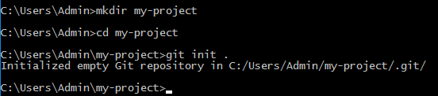
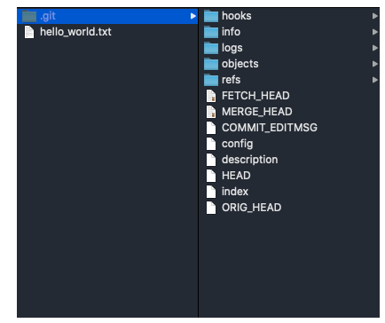
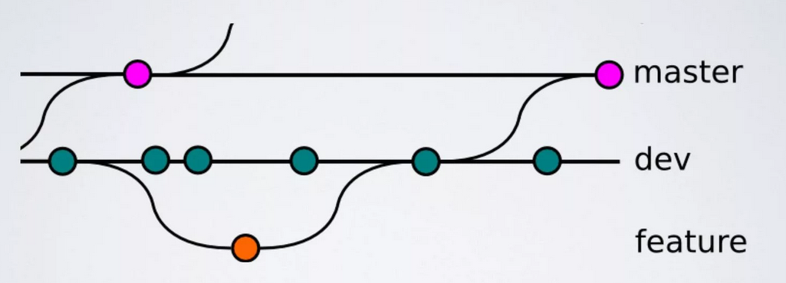
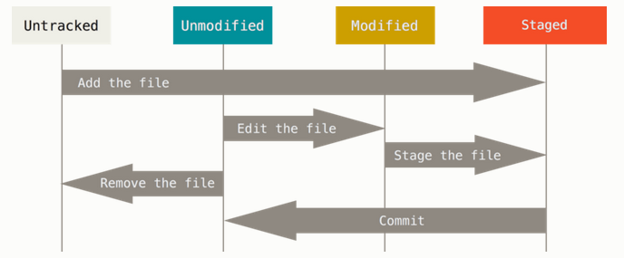
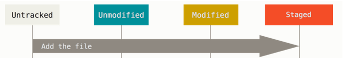
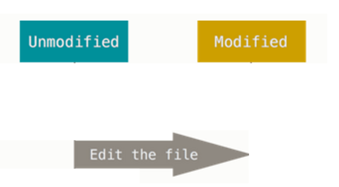
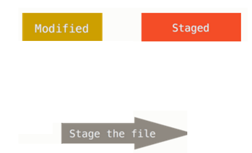
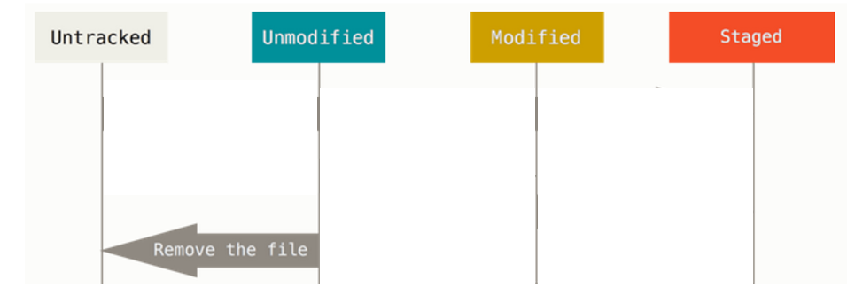

# Как создать локальный Git-репозиторий?

Существует два способа: _**создать (инициализировать) репозиторий с нуля**_ или _**клонировать к себе на компьютер уже  
существующий репозиторий**_.

_**В первом случае**_ (при инициализации) мы превращаем обычную папку с файлами (или без) в Git-репозиторий — связываем  
наш проект с системой Git — придерживаясь следующего алгоритма действий:  

1) Открываем терминал, создаем через него папку/директорию будущего проекта с помощью команды `mkdir имя_папки`.<br><br>

2) Заходим в нее с помощью команды `cd имя_папки`.<br><br>

3) Инициализируем репозиторий в этой папке с помощью команды `git init .`, которая сообщает гиту о том, что на основе  
данной папки нужно создать Git-репозиторий. Точка после пробела в конце команды обязательна, она говорит Гиту, что  
именно в этой папке, где мы сейчас находимся, и будет база данных Git.

_**Очень важно! Git-репозиторий можно инициализировать только из директории, в которой мы находимся.**_

_**Команда `mkdir имя_папки` создает новую директорию.**_

_**Команда `cd имя_папки` открывает директорию.**_

_**Команда `git init .` создает репозиторий в папке/директории, откуда она была вызвана.**_

Если директория уже есть и мы хотим ее сделать Git-репозиторием, то делаем все то же самое, зайдя в нужную папку. Через  
терминал переходим в нее с помощью команды cd имя_папки и инициализируем репозиторий с помощью команды `git init .`.

_**Во втором**_ случае мы будем клонировать себе на компьютер копию репозитория из удаленного сервиса (например, GitHub).  
Для этого нужно выполнить команду `git clone` с указанием ссылки на удаленный репозиторий. У любого репозитория, который  
лежит удаленно, есть ссылка, которая нужна для клонирования. Выполнив `git clone ссылка_на _удаленный_репозиторий`, мы  
склонируем этот репозиторий к себе на компьютер и можем с ним работать.

## Разбор 1-го варианта — инициализация нового репозитория  

Для начала создадим в терминале папку **my-project**.

`mkdir my-project` — создаем папку **my-project**

`cd my-project` — заходим в папку **my-project**

Пока еще эта папка не будет локальным Git-репозиторием: Гит за ней не следит и вообще ее не видит. Для того, чтобы  
подключить Гит, нужно создать базу данных для него (с помощью команды `git init .`). Так мы создадим на базе текущей  
папки **my-project** новый подкаталог **.git** (репозиторий Git), в котором и будет содержаться вся конфигурация Git и история  
проекта.

`git init .` — инициализируем новый репозиторий из папки, где мы сейчас находимся (**my-project**).

Папка **my-project** после этого будет локальным репозиторием. В ней будут содержаться все изменения проекта в  
хронологическом порядке, потому что **с этого момента, она под контролем Git!**

Внутри папки **my-project** Гит сам создаст специальную папку **.git**, где будут храниться все файлы в истории проекта:  



Если вдруг после `git init .` не появляется папка **.git** в папке **my-project**, проверьте ее на "скрытность", возможно, папка  
**.git** была скрыта настройками вашей операционной системы.

### P.S.

`mkdir my-project` - создание папки **my-project**.

`cd my-project` - переход в папку **my-project**.

`git init .` - инициализация репозитория.

`dir` или `ls -la`- просмотр директории.

## Что Git хранит в локальном репозитории?

Итак, с помощью `git init .` мы создали на базе текущей папки **my-project** локальный репозиторий, в котором содержится  
вся конфигурация Git и история проекта.

Зайдем в эту директорию с помощью команды `ls .git`(быстрый просмотр содержимого папки .git) и рассмотрим, какие файлы  
и папки она содержит:



1. В папке **hooks** гит хранит набор скриптов, которые могут автоматически запускаться во время выполнения git команд.<br><br>

2. В папку **info** гит заботливо поместит файл **exclude**, в котором можно указывать любые файлы, и гит не станет  
добавлять их в свою историю. Это почти то же самое что и **.gitingnore** (рассмотрим чуть позже), за тем исключением, что **exclude**  
не сохраняется в истории проекта, и мы не сможем им поделиться с другими.<br><br>

3. В папке **logs** гит будет хранить историю проекта для всех веток в этом проекте.<br><br>

4. В папке **objects** гит соберет blob-объекты, каждый из которых проиндексирован уникальным SHA.<br><br>  

5. В папку **refs** гит закинет копию ссылок на объекты коммитов в локальных и удаленных ветках.<br><br>  

6. _**FETCH_HEAD**_ и _**MERGE_HEAD**_ хранят в себе ссылки в виде SHA на ветки, которые участвовали соответственно в `git fetch`  
или `git merge`.<br><br>  

7. В файле **COMMIT_EDITMSG** содержится последнее введенное нами сообщение коммита (да, к коммиту надо добавлять  
сообщение).<br><br>  

8. Файл **config** содержит настройки Git репозитория.<br><br>  

9. Файл **description** содержит в себе название проекта и его описание. Он предназначен для GitWeb, специального  
веб-интерфейса, написанного для просмотра Git репозитория через веб-браузер.<br><br>  

10. Файл **HEAD** содержит ссылку на текущую ветку, в которой мы работаем.<br><br>  

11. Файл **index** является промежуточной областью с файлами, которые уже упакованы Git. Это хранилище для файлов с  
изменениями, информация о которых потом попадет в единый коммит.<br><br>  

12. В файл **ORIG_HEAD** будет попадать ветка, с которой проводилось слияние.<br><br>  

## Как посмотреть информацию о статусе файлов, находящихся в репозитории?

`git status` показывает, что происходит в данный момент, на каком этапе мы сейчас находимся, каков статус всех файлов:  
количество **untracked** (неотслеживаемых), **deleted** (удаленных), **new** (новых) и **прочих** файлов, количество  
коммитов, на которое отличается локальная версия репозитория от удаленного и т.д.

`git status` – выводит информацию о статусе файлов, находящихся в репозитории.

Задав команду `git status` сейчас, мы увидим, что в папке **my-project** пока ничего не было сделано.
```commandline
No commits yet

nothing to commit # – репозиторий пока пустой
```
Создав _**NewFile.txt**_ и проверив состояние командой `git status` git сообщит следующее:

```commandline
...
Untracked files:
  (use "git add <file>..." to include in what will be committed)
        NewFile.txt
...
```

Мы видим, что наша директория действительно находится под версионным контролем: гит увидел новый для него файл,  
подсветит его красным цветом и определил, что он – **Untracked**. В данном состоянии Git **просто знает об этом файле** в  
проекте, **но еще не отслеживает** его изменения. Git не следит за изменениями в таких файлах потому, что эти изменения  
не добавлены в репозиторий. Но сами файлы видит.

Чтобы отслеживать файл, мы должны его зафиксировать (сделать коммит). А прежде чем зафиксировать, нам надо подготовить  
его к фиксации — отправить его в промежуточную область — **Stage (Staging area, Индекс, стадия подготовленных файлов)**.

## Что такое Stage (Staging area, Индекс, стадия подготовленных файлов)?

**Stage ("стейдж")** — стадия/область подготовленных файлов, в it-терминологии называется **Индексом**. Технически это просто  
файл, содержащий имена файлов и изменения в них, которые должны войти в следующий коммит.

Для добавления файла в **Stage/Индекс** используется команда `git add`, а сам процесс добавления файлов в промежуточную  
область называется **индексацией**. **Индекс** — промежуточное место между нашим прошлым коммитом и следующим. Мы можем  
добавлять (`git add`) или удалять (`git reset`) файлы из индекса, а можем просто просмотреть индекс с помощью  
команды`git status`.

Добавим файл NewFile.txt в индекс с помощью `git add NewFile.txt`. С этого момента Git начинает его отслеживать:

```commandline
...
Changes to be committed:
  (use "git restore --staged <file>..." to unstage)
        new file:   NewFile.txt
...
```

**Важно!** Если в последующем мы что-то изменим в файле, но не сделаем для него `git add`, а сразу закоммитим, то эти  
изменения не войдут в коммит. В коммите будет только **старая версия файла**, которая была до изменений (если  
таковая имеется).

## Что такое коммит?

**Коммит** — фиксация изменений, внесенных в **индекс**. Т.е мы всегда сначала добавляем файл с помощью `git add` в  
**индекс** и только потом делаем коммит — кладем их в базу данных Гита.

Еще говорят, что коммит — это снимок текущего состояния изменений, добавленных в индекс или единица изменений в  
проекте. Коммиты можно рассматривать как "безопасные" версии проекта — Git не будет их менять, пока мы явным образом  
не попросим об этом.

Последовательность коммитов представляет собой ни что иное как ветку. Любая ветка состоит из коммитов. Рассмотрим  
пример — рисунок ниже, где представлены 3 ветки: **master**, **dev** и **feature**:



**Круги** – это коммиты. Разработчик работает с веткой **dev**, коммитит свои изменения (т.е. сохраняет их снимок  
во внутренней базе данных Гит), немного поработал на отдельной ветке **feature** (чтобы не портить ветку **dev**), сделал  
в ней коммит и затем влил ветку **feature** в **dev**, а те изменения, которые готовы – отправил на основную ветку **master**.  

Команда `git commit` делает коммит. Каждый коммит имеет:

1. **Хэш**, например, `549892a096...2184cf57f7` – это уникальный идентификатор коммита, который позволяет в любое время  
к нему откатиться;<br><br>  

2. **Сообщение**, например **"Added files"** (commit message говорит, **ЧТО делает коммит**, а не **КАК делает**);<br><br>  

3. **Индексированные** файлы репозитория;<br><br>

4. **Изменения** по каждому файлу;<br><br>

5. **Имя автора** и **время создания** коммита.

Команда `git commit` берет все подготовленные изменения (они могут включать любое количество файлов), добавленные в  
индекс с помощью `git add`, и отправляет их в репозиторий как единое целое.

Мы создали **NewFile.txt**, добавили в индекс, осталось его закоммитить командой `git commit` и оставить небольшое  
описание в кавычках. Комментарий оставляем обязательно, т.к. сделать коммит без него не получится:

`git commit -m "my first commit, this is Version 1.0"` — таким образом мы сделаем наш первый коммит

Ключ `-m` расшифровывается как **"message"** — сообщение.

Если сейчас посмотреть статус `git status`, то увидим, что никаких изменений нет, а наши файлы соответствуют  
последнему снимку: 
```commandline
On branch master
nothing to commit, working tree clean
```

Сделать коммит — это значит:

1) Сделать изменения;<br><br>

2) Собрать эти изменения командой `git add`;<br><br>

3) И дать команду `git commit -m 'сообщение'`.<br><br>  

## P.S.

Что было проделано:

1. Создали репозиторий;<br><br>

    На базе папки **my-project** с помощью команды `git init .` мы инициализировали репозиторий Git. Теперь наш проект  
    (наша папка) **my-project** будет под версионным контролем Git. Директория **.git** – это база данных Git. Именно в  
    нее будут сохраняться все наши изменения. Репозиторий готов к работе и Git знает, что у него есть под контролем  
    этот репозиторий.<br><br>  

2. В папке **my-project** через терминал мы создали файл, который Гит увидел, но сначала не отслеживал его изменения.<br><br> 

3. Чтобы он его отслеживал, мы добавили файл в индекс командой `git add NewFile.txt`, т.е. проиндексировали наш файл –  
    добавили его в Stage, показав тем самым гиту, что этот файл должен войти в последующий коммит.<br><br> 

4. Закоммитили файл командой `git commit -m "описание"`. Коммит говорит Гиту, что теперь наш файл готовы к отправке в  
    удаленный репозиторий.<br><br> 

Потом нам останется связать локальный и удаленный репозитории с помощью определенной команды, которая дает Git'у знать,  
где находится удаленный сервер (куда отправлять файлы). И затем отправим файл в удаленный репозиторий (запушим,  
используем команду `git push`) на удаленный сервер, чтобы другие разработчики тоже имели к нему доступ.<br><br>  

### P.S.S.

`git init .` – создает новый репозиторий;

`git status` – отображает список измененных, добавленных и удаленных файлов;

`git add` – добавляет указанные файлы в индекс (обязательно перед последующим коммитом);

`git reset` – отменяет действие команды git add на файл;

`git commit -m "сообщение"` – фиксирует добавленные в индекс изменения с определенным сообщением;

`git push` – отправляет изменения на удаленный репозиторий;

`dir .git` или `ls .git `– выводит содержимое папки .git;

`dir` или `ls -la` – выводит список файлов и папок.

___

# Более подробно о статусах (состояниях) файлов в Git

**untracked** — существующий в репозитории, но не отслеживаемый гитом файл

**unmodified** — не измененный, но уже отслеживаемый гитом файл

**modified** — измененный и отслеживаемый гитом файл

**staged** — проиндексированный (подготовленный к коммиту) и отслеживаемый гитом файл

Каждый файл в рабочем каталоге находится в одном из двух состояний:

- отслеживаемый Гитом (он уже о нем знает)  
<br>
- не отслеживаемый.

**Отслеживаемые файлы** — это те файлы, для которых **был сделан коммит** (он зафиксирован, для него есть последний снимок  
состояния в проекте). Они могут быть не измененными (**Unmodified**), измененными (**Modified**) или подготовленными к  
коммиту (**Staged**).

**Не отслеживаемые файлы** — это любые файлы в рабочем каталоге, которым еще **не делался коммит** и они еще не  
подготовлены к коммиту.



1. Состояние **Untracked** имеют все не отслеживаемые файлы и папки. Они есть в репозитории, **Гит их видит, но не следит**  
за ними.  

С помощью команды `git add` мы добавляем такой файл (**Untracked**) в **Индекс**:  



_"Add the file" — "добавить файл"_

И этот файл переходит в состояние **Staged** и начинает отслеживаться Гитом: **Untracked (`git add`)> Staged**

- Git взял файл, создал для него новый объект, добавил его в папку **оbjects** каталога **.git** в свою базу данных и дал ему  
имя — т.е. сохранил его как **блоб-файл**. Все файлы ссылаются друг на друга с помощью 40-значного SHA-1 — уникального  
идентифицирующего хэша. Его можно посмотреть в репозитории с помощью команды `find .git/objects` — покажет все файлы в  
указанной папке. Первые 2 символа определяют подкаталог файла(например 27) остальные 38 — имя. Данный блоб-файл хранит  
снимок содержания файла. Git создал директорию (например **.git/objects/27**) и сохранил в нее блоб-файл с именем  
в 38 символов.

Получить обратно содержимое объекта можно командой `cat-file -p 40-значный_хэш`

- Добавил имя сохраненного blob-файла в индекс. То есть поместил строку из имени и хэша blob-файла в **.git/index**.  
  (Например `File.txt 40-знаный_хэш`)

2. Если файл находится в состоянии **Unmodified** (уже отслеживается гитом, но не измененный) и мы его изменяем —  
добавляем строчки, удаляем что-то и т.д.:



_"Edit the file" — "редактировать файл"_

Теперь он переходит в состояние **Modified**: **Unmodified > Modified**

В этом состоянии Git продолжает осуществлять контроль над всеми сделанными в этом файле изменениями, просто файл не  
будет добавлен в следующий коммит. Статус **Modified** показывает, что файл имеет историю в системе Git и был изменен  
относительно его последнего состояния.

3. Когда мы переносим наш уже измененный файл в промежуточную область:



_"Stage the file" — "проиндексировать файл"_

Он переходит в состояние **Staged**: **Modified > Staged**

4. Когда мы поместили файл в **Индекс** и решили, что будем делать коммит этого файла (который теперь находится в  
состоянии **Staged**), то после выполнения коммита все изменения зафиксируются и больше изменений в данном файле в  
рабочей директории нет. Все изменения были перенесены в базу. Поэтому данный файл возвращается в свое изначальное  
состояние — **Unmodified** (не измененный отслеживаемый):


**Staged > Unmodified**

Весь цикл можно представить следующим образом: мы изменяем файл, сохраняем его в индексе и делаем коммит, а потом все  
сначала: **Unmodified > Modified > Staged > Unmodified**

5. Мы всегда можем удалить любой файл, который отслеживается Гитом — сделать его не отслеживаемым (**Untracked**):



_"Remove the file" — "удалить файл"_

Такой файл будет лежать вместе с остальными файлами в репозитории, но Гит на него не будет обращать внимания.

___

# .gitignore зачем и как

В Git можно с помощью текстового редактора создать специальный игнорируемый файл **.gitignore** нем вручную  
перечисляются **glob-шаблоны**, соответствующие таким файлам, которые мы не хотим отслеживать и отправлять в  
репозиторий. Git для себя помечает **.gitignore** как файл, содержимое которого необходимо игнорировать.

Например содержание **.gitignore** может быть таким:
```commandline
/.idea
*.rbc
.rspec
/db/*.sqlite3
Somefile.txt
```

После добавления шаблонов в **.gitignore** и выполнение команд `git add .` , создание новых файлов, попадающих под  
шаблон, не будет отображаться в `git status`. 

### О glob-шаблонах кратко:

Они представляют собой упрощенные регулярные выражения, используемые командными интерпретаторами:

- символ * соответствует 0 или более символам;

- последовательность [abc] — любому символу из указанных в скобках (в данном примере a, b или c);

- знак вопроса ? соответствует одному символу;

- квадратные скобки, в которые заключены символы через дефис [0-9], соответствуют любому символу из интервала (в данном  
случае от 0 до 9).

Также можно использовать две звездочки, чтобы указать на вложенные каталоги: a/**/z соответствует a/z, a/b/z, a/b/c/z,  
и так далее.


