# Редактирование закоммиченных файлов.

## Версии репозитория.

Создав два файла **file1.txt**, **file2.txt** c неким содержимым, мы индексируем их через `git add` и коммитим с помощью  
команды `git commit -m "message"`. На данный момент мы имеем **первую версию репозитория**. Теперь создадим **file3.txt**  
и добавим его в индекс `git add`. Сейчас у нас будет 3 файла: 2 закоммиченных и один новый, отслеживаемый гитом. Теперь  
изменим **file1.txt** и проверим статус `git status` можно увидеть: 1 **new file** и 1 **modified**. Индексируем  
(`git add .`) файлы и коммитим их (`git commit -m "message"`). Теперь у нас 2 коммита - 2 версии репозитория:

**В первой версии** репозитория хранятся созданные нами 3 файла:

**file1.txt** (закоммичен)

**file2.txt** (закоммичен)

**file3.txt** (отслеживается)

**Во второй версии** хранятся эти же самые файлы, но:

**file1.txt** изменен (в file1.txt мы поменяли содержание)

**file2.txt** остался такой же, как и в первой версии

**file3.txt** закоммичен.


Если, например, нам что-то надо поменять в file3.txt, то мы его редактируем, потом снова коммитим — у нас уже будет  
**третья версия** репозитория:  

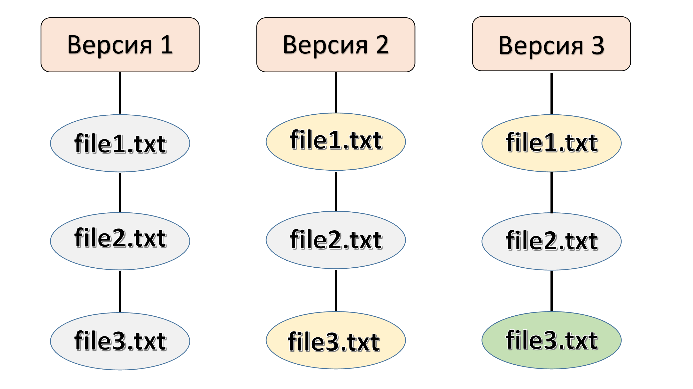

___

# История изменений

Сохранение истории изменений (истории коммитов) — одна из самых важных частей Git. В истории сохраняются все коммиты,  
по которым можно посмотреть автора коммита, комментарий, дату коммита и его хэш. А также можно увидеть измененные  
файлы и изменения в каждом файле: Git хранит буквально все, от самого начала проекта.  

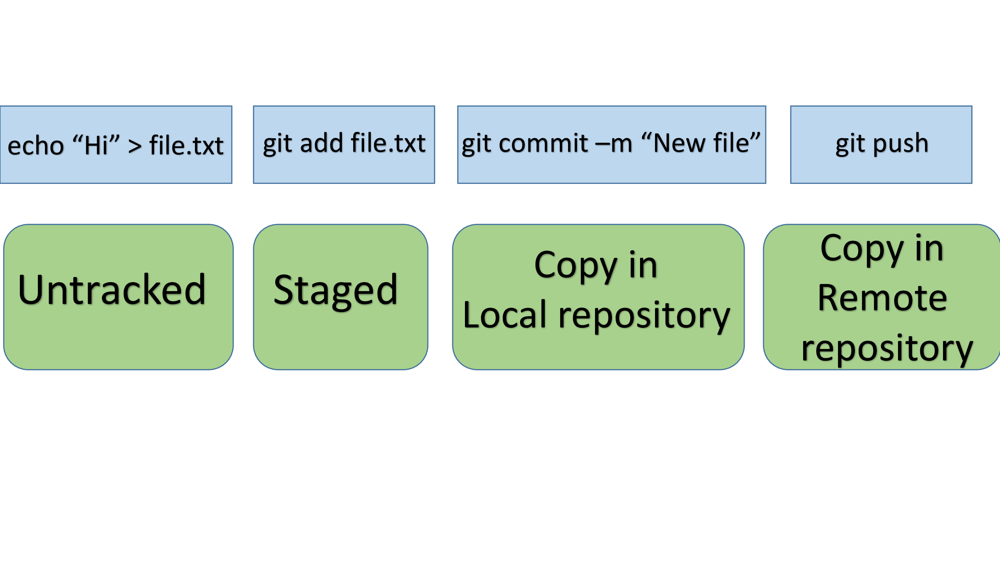

1. Когда мы только создали какие-то файлы, они еще не отслеживается Гитом и имеют состояние **Untracked** — мы создали  
изменения.  


2. Когда мы добавили их в Индекс, они стали **Staged** — отслеживаемые Гитом — мы записали эти изменения.  


3. Как только мы сделали коммит — файлы стали версией локального репозитория — мы сохранили эти изменения.  


И если после всего этого задать команду `git push`, то мы отправим изменения с локального репозитория на сервер в  
удаленный репозиторий (например, на GitHub).  


## Как посмотреть историю изменений (коммитов)?  

История коммитов содержит сведения о каждом проведенном коммите проекта.  

Запросить историю изменений можно с помощью команды `git log.`, с ее помощью можно:  

1) найти конкретную версию проекта (конкретный коммит);  

2) определить кто, когда и какие изменения сделал;  

3) вспомнить хэш коммита, к которому нужно вернуться;  

4) фильтровать коммиты;  

5) просто проследить за историей развития проекта.  

в **Pycharm** `git log` выдает последние 2 коммита, что бы пролистать дальше на 1 надо нажать `d`, на 2 - `space`.  

Пример вывода `git log`:

```commandline
commit 66c39a2fd4f4cafb89c01309131afc9d11003dfa (HEAD -> main, origin/main, origin/HEAD)
Author: anyway <dfrozzze@gmail.com>
Date:   Sat Jan 6 07:22:32 2024 +0300

    second commit

commit 4ed51984b0e9c5ac209ccfc675d78d4d3310e4d4
Author: anyway <dfrozzze@gmail.com>
Date:   Sat Jan 6 07:11:31 2024 +0300

    first commit

```

История коммитов отображается в обратном порядке — наверху самый свежий коммит, а под ним более старые. 

### Параметры (флаги) для команды git log

Мы можем фильтровать логи с помощью флагов, например:

1) `git log -число` — ограничит количество отображаемых коммитов указанным числом. Команда выводит столько последних  
коммитов, сколько мы ей укажем.  

2)  `git log --pretty=medium` - стандартное значение. Чаще используется `--pretty=oneline` - идентификатор коммита и  
его сообщение. Для сокращенния индентификатора коммита в выводе добавляется `--abbrev-commit`. А краткая форма записи  
выглядит как `git log --oneline`.  

3) `git log -p `— отобразит разницу, внесенную в каждый коммит. Разница часто называется диффом, а аргумент `-p` иногда  
заменяют на `--patch`.  

4) `git log --stat` - покажет краткую статистику по каждому коммиту.

5) `git log --author="АВТОР"` - найдет коммиты "АВТОР"

## Просмотр отдельного коммита

### Команда git show

Чтобы просмотреть отдельный коммит, нам нужна команда `git show` и идентификатор (хэш) коммита. Хэш выводится в любой  
команде git log.

### P.S.

`git log` — показывает историю коммитов. Клавиша q — для того, чтобы выйти из лога

`git log -2` — показывает последние 2 коммита

`git log -p` — расширенный вывод истории: выводит то же, что и git log, но еще и с изменениями в файлах

`git log --oneline` — выводит коммиты в одну строку, показывая только хэш коммита и commit message

`git log --pretty=format:" "` — меняет формат вывода лога в соответствии с указанными в кавычках параметрами

`git show хэш_коммита` — показывает информацию по отдельному коммиту

___

## Команда git checkout

В Git под термином **checkout** ("**чекаут**") подразумевают переключение между различными объектами.  

Команда git checkout работает с тремя объектами:

1) Файлами;
2) Коммитами;
3) Ветками.

### git checkout по отношению к файлам

После изменения содержимого, файл приобретает статус **Modifield**. Для отмены только что сделанных изменений  
используется `git checkout -- имя_файла`. Команда переключит на прежнюю версию файла. Остается заново выполнить  
индексацию и закоммитить. 

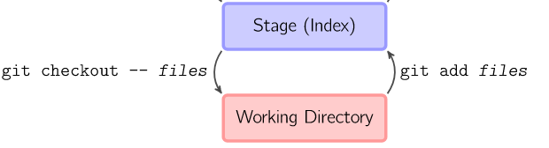

`git checkout -- имя_файла` — для отмены изменений в файлах, которые в статусе **Modified**, еще не закоммичены.

### git checkout по отношению к коммитам

Для переключения между коммитами используется `git checkout хэш_коммита`. Причем хэш можно использовать как полный, так  
и первые 7(или вообще 4) символа.  

После выполнения, все файлы в проекте станут такими, какие они были в данном коммите. Терминал выдаст сообщение типа:
```commandline
...
"HEAD is now at 822f2c1 message"
```
Указатель **HEAD** стоит на коммите 822f2c1.  

### Что такое HEAD вкратце

Ниже этот пункт рассмотрен детальней.

**HEAD** – это указатель, задача которого ссылаться на последний коммит, сделанный в текущей ветке:  

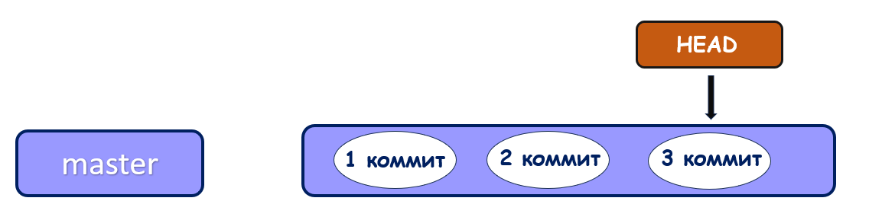

При переключении с помощью `git checkout хэш_коммита`, HEAD будет указывать на тот коммит, хэш которого был указан.  
Для возврата после просмотра коммита используется `git checkout -`. После этой команды, HEAD вернется в ту точку, из  
которой был сделан переход(Даже если переход был между ветками).

### git checkout по отношению к веткам

Для переключения используется `git checkout имя_ветки`.  

При переключении ветки происходит обновление файлов в Рабочем каталоге в соответствии с версией, хранящейся в этой  
ветке. Git начинает записывать все новые коммиты уже в этой ветке. 

После переключения ветки, **HEAD** указывает на последний коммит в ветке. Используя `git log`, видно,  
что **HEAD->имя_ветки**:

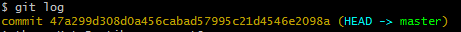

### P.S.

`git log` — показывает историю коммитов

`git checkout -- file1.txt` — отменяет изменения в рабочем каталоге, переключает на указанный файл

`git checkout хэш-коммита` — переводит на любой коммит в истории наших изменений

`git checkout master` — переключает указатель HEAD на самый верх, в последнюю версию изменений

___

## Что такое HEAD и не только HEAD

Git управляет содержимым трех разных наборов файлов (эти наборы правильнее называются деревьями): **HEAD**, **Индекс** и  
**Рабочий каталог**:

1. Набор файлов (=дерево) "**HEAD**" содержит снимок самого последнего коммита.  

2. Набор файлов (=дерево) "**Индекс**" содержит снимок следующего намеченного коммита.  

3. Набор файлов (=дерево) "**Рабочий каталог**" — своеобразная песочница файлов и папок.  

После создания файла только **дерево Рабочего каталога** будет его содержать:

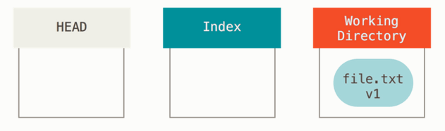

Теперь индексируем файл с помощью `git add`. В этот момент происходит копирование **Рабочего каталога** в **Индекс**:  

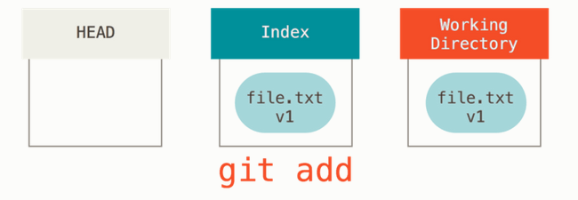

А `git commit` сохраняет содержимое **Индекса** как неизменяемый снимок. Если сейчас выполнить `git status`, то никаких  
изменений не будет, так как все **три дерева одинаковые**:  

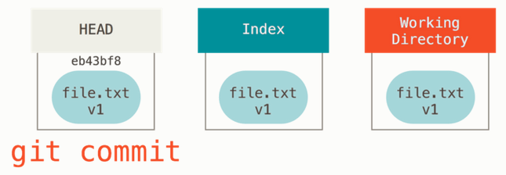

Таким образом, всегда есть три активные копии каждого файла:

- один в HEAD;
- один в Индексе;
- один в Рабочем каталоге.

Команда `git status` просматривает **все три копии**. Сначала Git сравнивает **HEAD** и **Индекс** (выявляет список  
изменений, которые необходимо зафиксировать), а затем **Индекс** и **Рабочий каталог** (определяет список изменений, не  
подготовленных для фиксации).

Так же `git commit` обновляет **master branch** так, чтобы она тоже указывала на этот коммит:

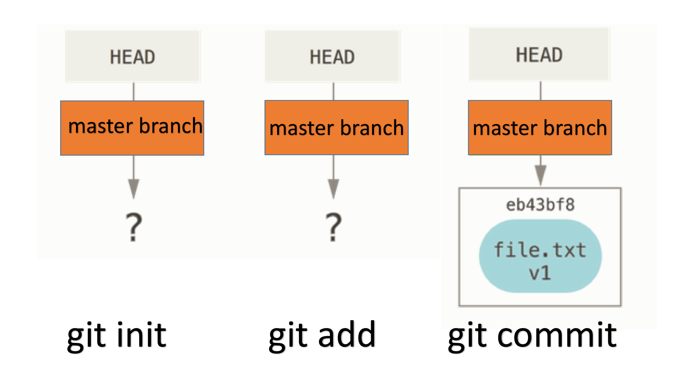

Если сейчас изменить файл file.txt и закоммитить его, то в таком случае будет версия файла **v2**.

Сначала файл отредактирован в **Рабочем каталоге**:

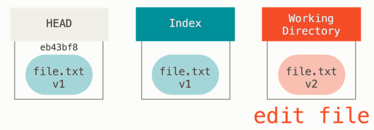

В данный момент статус file.txt v2 будет **красным Modified** т.к. его представления в **Индексе** и **Рабочем каталоге**  
различны. Выполнив `git add` для этого файла, чтобы поместить его в **Индекс**:

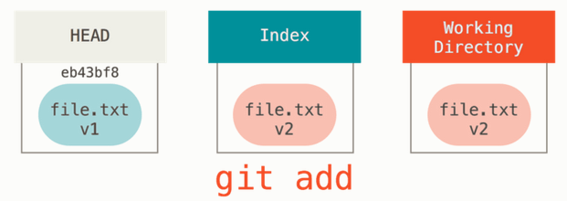

Теперь его статус: **зеленый modified**. Он выделен зеленым цветом — значит это изменения, которые будут закоммичены,  
ведь **Индекс** и **HEAD** различны. То есть следующий намеченный коммит отличается от последнего. Выполним `git commit`,  
чтобы окончательно совершить коммит:

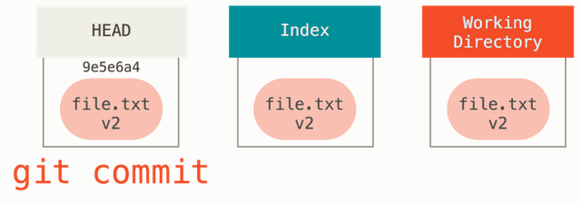

Все **три дерева снова одинаковые**, а` git status` покажет: `On master branch, No commits yet, nothing to commit`.

Переключение веток и клонирование проходят через похожий процесс. Когда мы переключаемся на ветку, **HEAD** начинает также  
указывать на новую ветку, **Индекс** замещается снимком коммита этой ветки, и затем содержимое **Индекса** копируется  
в **Рабочий каталог**.

___
