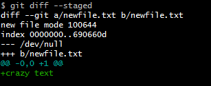

# Редактирование закоммиченных файлов.

## Версии репозитория.

Создав два файла **file1.txt**, **file2.txt** c неким содержимым, мы индексируем их через `git add` и коммитим с помощью  
команды `git commit -m "message"`. На данный момент мы имеем **первую версию репозитория**. Теперь создадим **file3.txt**  
и добавим его в индекс `git add`. Сейчас у нас будет 3 файла: 2 закоммиченных и один новый, отслеживаемый гитом. Теперь  
изменим **file1.txt** и проверим статус `git status` можно увидеть: 1 **new file** и 1 **modified**. Индексируем  
(`git add .`) файлы и коммитим их (`git commit -m "message"`). Теперь у нас 2 коммита - 2 версии репозитория:

**В первой версии** репозитория хранятся созданные нами 3 файла:

**file1.txt** (закоммичен)

**file2.txt** (закоммичен)

**file3.txt** (отслеживается)

**Во второй версии** хранятся эти же самые файлы, но:

**file1.txt** изменен (в file1.txt мы поменяли содержание)

**file2.txt** остался такой же, как и в первой версии

**file3.txt** закоммичен.


Если, например, нам что-то надо поменять в file3.txt, то мы его редактируем, потом снова коммитим — у нас уже будет  
**третья версия** репозитория:  


___

# История изменений

Сохранение истории изменений (истории коммитов) — одна из самых важных частей Git. В истории сохраняются все коммиты,  
по которым можно посмотреть автора коммита, комментарий, дату коммита и его хэш. А также можно увидеть измененные  
файлы и изменения в каждом файле: Git хранит буквально все, от самого начала проекта.  


1. Когда мы только создали какие-то файлы, они еще не отслеживается Гитом и имеют состояние **Untracked** — мы создали  
изменения.  


2. Когда мы добавили их в Индекс, они стали **Staged** — отслеживаемые Гитом — мы записали эти изменения.  


3. Как только мы сделали коммит — файлы стали версией локального репозитория — мы сохранили эти изменения.  


И если после всего этого задать команду `git push`, то мы отправим изменения с локального репозитория на сервер в  
удаленный репозиторий (например, на GitHub).  


## Как посмотреть историю изменений (коммитов)?  

История коммитов содержит сведения о каждом проведенном коммите проекта.  

Запросить историю изменений можно с помощью команды `git log.`, с ее помощью можно:  

1) найти конкретную версию проекта (конкретный коммит);  

2) определить кто, когда и какие изменения сделал;  

3) вспомнить хэш коммита, к которому нужно вернуться;  

4) фильтровать коммиты;  

5) просто проследить за историей развития проекта.  

в **Pycharm** `git log` выдает последние 2 коммита, что бы пролистать дальше на 1 надо нажать `d`, на 2 - `space`.  

Пример вывода `git log`:

```commandline
commit 66c39a2fd4f4cafb89c01309131afc9d11003dfa (HEAD -> main, origin/main, origin/HEAD)
Author: anyway <dfrozzze@gmail.com>
Date:   Sat Jan 6 07:22:32 2024 +0300

    second commit

commit 4ed51984b0e9c5ac209ccfc675d78d4d3310e4d4
Author: anyway <dfrozzze@gmail.com>
Date:   Sat Jan 6 07:11:31 2024 +0300

    first commit

```

История коммитов отображается в обратном порядке — наверху самый свежий коммит, а под ним более старые. 

### Параметры (флаги) для команды git log

Мы можем фильтровать логи с помощью флагов, например:

1) `git log -число` — ограничит количество отображаемых коммитов указанным числом. Команда выводит столько последних  
коммитов, сколько мы ей укажем.  

2)  `git log --pretty=medium` - стандартное значение. Чаще используется `--pretty=oneline` - идентификатор коммита и  
его сообщение. Для сокращенния индентификатора коммита в выводе добавляется `--abbrev-commit`. А краткая форма записи  
выглядит как `git log --oneline`.  

3) `git log -p `— отобразит разницу, внесенную в каждый коммит. Разница часто называется диффом, а аргумент `-p` иногда  
заменяют на `--patch`.  

4) `git log --stat` - покажет краткую статистику по каждому коммиту.

5) `git log --author="АВТОР"` - найдет коммиты "АВТОР"

## Просмотр отдельного коммита

### Команда git show

Чтобы просмотреть отдельный коммит, нам нужна команда `git show` и идентификатор (хэш) коммита. Хэш выводится в любой  
команде git log.

### P.S.

`git log` — показывает историю коммитов. Клавиша q — для того, чтобы выйти из лога

`git log -2` — показывает последние 2 коммита

`git log -p` — расширенный вывод истории: выводит то же, что и git log, но еще и с изменениями в файлах

`git log --oneline` — выводит коммиты в одну строку, показывая только хэш коммита и commit message

`git log --pretty=format:" "` — меняет формат вывода лога в соответствии с указанными в кавычках параметрами

`git show хэш_коммита` — показывает информацию по отдельному коммиту

___

## Команда git checkout

В Git под термином **checkout** ("**чекаут**") подразумевают переключение между различными объектами.  

Команда git checkout работает с тремя объектами:

1) Файлами;
2) Коммитами;
3) Ветками.

### git checkout по отношению к файлам

После изменения содержимого, файл приобретает статус **Modifield**. Для отмены только что сделанных изменений  
используется `git checkout -- имя_файла`. Команда переключит на прежнюю версию файла. Остается заново выполнить  
индексацию и закоммитить. 


`git checkout -- имя_файла` — для отмены изменений в файлах, которые в статусе **Modified**, еще не закоммичены.

### git checkout по отношению к коммитам

Для переключения между коммитами используется `git checkout хэш_коммита`. Причем хэш можно использовать как полный, так  
и первые 7(или вообще 4) символа.  

После выполнения, все файлы в проекте станут такими, какие они были в данном коммите. Терминал выдаст сообщение типа:
```commandline
...
"HEAD is now at 822f2c1 message"
```
Указатель **HEAD** стоит на коммите 822f2c1.  

### Что такое HEAD вкратце

Ниже этот пункт рассмотрен детальней.

**HEAD** – это указатель, задача которого ссылаться на последний коммит, сделанный в текущей ветке:  


При переключении с помощью `git checkout хэш_коммита`, HEAD будет указывать на тот коммит, хэш которого был указан.  
Для возврата после просмотра коммита используется `git checkout -`. После этой команды, HEAD вернется в ту точку, из  
которой был сделан переход(Даже если переход был между ветками).

### git checkout по отношению к веткам

Для переключения используется `git checkout имя_ветки`.  

При переключении ветки происходит обновление файлов в Рабочем каталоге в соответствии с версией, хранящейся в этой  
ветке. Git начинает записывать все новые коммиты уже в этой ветке. 

После переключения ветки, **HEAD** указывает на последний коммит в ветке. Используя `git log`, видно,  
что **HEAD->имя_ветки**:


### P.S.

`git log` — показывает историю коммитов

`git checkout -- file1.txt` — отменяет изменения в рабочем каталоге, переключает на указанный файл

`git checkout хэш-коммита` — переводит на любой коммит в истории наших изменений

`git checkout master` — переключает указатель HEAD на самый верх, в последнюю версию изменений

___

## Что такое HEAD и не только HEAD

Git управляет содержимым трех разных наборов файлов (эти наборы правильнее называются деревьями): **HEAD**, **Индекс** и  
**Рабочий каталог**:

1. Набор файлов (=дерево) "**HEAD**" содержит снимок самого последнего коммита.  

2. Набор файлов (=дерево) "**Индекс**" содержит снимок следующего намеченного коммита.  

3. Набор файлов (=дерево) "**Рабочий каталог**" — своеобразная песочница файлов и папок.  

После создания файла только **дерево Рабочего каталога** будет его содержать:


Теперь индексируем файл с помощью `git add`. В этот момент происходит копирование **Рабочего каталога** в **Индекс**:  


А `git commit` сохраняет содержимое **Индекса** как неизменяемый снимок. Если сейчас выполнить `git status`, то никаких  
изменений не будет, так как все **три дерева одинаковые**:  


Таким образом, всегда есть три активные копии каждого файла:

- один в HEAD;
- один в Индексе;
- один в Рабочем каталоге.

Команда `git status` просматривает **все три копии**. Сначала Git сравнивает **HEAD** и **Индекс** (выявляет список  
изменений, которые необходимо зафиксировать), а затем **Индекс** и **Рабочий каталог** (определяет список изменений, не  
подготовленных для фиксации).

Так же `git commit` обновляет **master branch** так, чтобы она тоже указывала на этот коммит:


Если сейчас изменить файл file.txt и закоммитить его, то в таком случае будет версия файла **v2**.

Сначала файл отредактирован в **Рабочем каталоге**:


В данный момент статус file.txt v2 будет **красным Modified** т.к. его представления в **Индексе** и **Рабочем каталоге**  
различны. Выполнив `git add` для этого файла, чтобы поместить его в **Индекс**:


Теперь его статус: **зеленый modified**. Он выделен зеленым цветом — значит это изменения, которые будут закоммичены,  
ведь **Индекс** и **HEAD** различны. То есть следующий намеченный коммит отличается от последнего. Выполним `git commit`,  
чтобы окончательно совершить коммит:


Все **три дерева снова одинаковые**, а` git status` покажет: `On master branch, No commits yet, nothing to commit`.

Переключение веток и клонирование проходят через похожий процесс. Когда мы переключаемся на ветку, **HEAD** начинает также  
указывать на новую ветку, **Индекс** замещается снимком коммита этой ветки, и затем содержимое **Индекса** копируется  
в **Рабочий каталог**.

___

## Отмена сделанных изменений в коммите

Несколько основных способов отмены сделанных изменений:

### Изменения в последнем коммите

`git add some_file `— Индексация файла после изменения

`git commit --amend -m "Message"` - Присоединение проиндексированных файлов в последний коммит с новым сообщением

`git commit --amend --no-edit` - Присоединение проиндексированных файлов в последний коммит без изменения сообщения

`git checkout master` или `git checkout main`- Вернуться к текущему состоянию проекта

### Изменение НЕ последнего коммита (или нескольких коммитов)

Для изменения не последнего коммита используется команда `git rebase`. Новый коммит заменит старый, поэтому команду  
_**запрещено применять**_ к коммитам, которые уже стали доступны всем — история проекта просто исчезнет. 

### Возможности rebase

#### Перемещение всех коммитов в стандартном режиме команды `git rebase`

Делая "**ребейз**", мы перебазируем — объединяем или перемещаем последовательность коммитов на новый родительский  
снимок. Команда в стандартном режиме выглядит следующим образом:

`git rebase имя_ветки`  

Рибейз изменит основу ветки с одного коммита на другой, как если бы мы начали ветку с другого коммита. В Git это  
достигается за счет создания новых коммитов и применения их к указанному базовому коммиту.  


У нас есть 2 ветки: **master** и **fix**. До rebase для ветки **fix** базовым коммитом был `a1e8fb5`, с него мы начали что-то  
разрабатывать, появились новые коммиты (`435b61d` и `9773e52`). А на ветку master в это время другие разработчики  
добавили коммит `ft371s9`, который нам очень понравился.

Вот бы использовать его в своей ветке **fix**! Начать разработку не с коммита `a1e8fb5`, а с коммита `ft371s9`. Но пока это  
невозможно, ведь этот коммит только на ветке **master**.

Как раз в таких ситуациях нам и нужен рибейз (точнее, команда `git rebase master`)— ветка **fix** начнется с коммита  
`ft371s9`, более нового состояния ветки **master**. После рибейза базовым коммитом для ветки **fix** станет `ft371s9`. Этот  
процесс и называется "перебазирование" — `rebase`.  

Что здесь произошло: мы, находясь на **fix**, дали команду перебазироваться на ветку master: `git rebase master`. Гит удалил и  
последовательно переместил коммиты `435b61d`, `9773e52` из ветки **fix** в ветку **master**, как будто мы начали разработку не с  
коммита `a1e8fb5`, а с коммита `ft371s9`. В ветке **fix** будут все последние изменения с ветки **master**, как мы этого и хотели.  

Перенесение означает, что эти же изменения будут применены, начиная с другого состояния проекта — с другого коммита.  
Команда `git rebase` выполняет 3 действия: 

1) переносит указатель **HEAD** **на тот коммит** на ветке **master**, к которому потом один за другим будет копировать все коммиты  
ветки **fix** (`ft371s9`). HEAD ставится не на саму ветку master! С веткой **master** рибейз ничего делает, его задача перебазировать  
ветку **fix**.

2) копирует на тот коммит (`ft371s9`) последовательно все коммиты ветки **fix**. Т.е. от коммита `ft371s9` один за другим  
появляются эквивалентные коммиты, которые содержат все те изменения, что и исходные. **HEAD** при этом тоже  
перемещается от коммита к коммиту:


3) переносит указатель **HEAD** на последний скопированный коммит. Исходные коммиты останутся в базе Гита, но они  
недостижимы и со временем будут удалены. Сам процесс перебазирования завершен.

Команду `git rebase` можно отменить.  

Например, мы перенесли коммиты на новое место, но потом поняли, что зря, и хотим данное действие отменить. Предыдущая  
версия ветки **fix** все еще в базе, нам надо лишь перенести указатель **HEAD** обратно на нее.

В начале работы команда `rebase` в папке **.git** создала файл-ссылку **ORIG_HEAD**, в котором сохранила идентификатор, откуда  
была перенесена ветка **fix**. Посмотреть его можно командой:

`cat .git/ORIG_HEAD`  

А команда `git reset --hard ORIG_HEAD` вернет ветку **fix** обратно. Если, конечно, у нас простая ситуация: не было ранее  
никаких откатов в предыдущее состояние. Если же откаты были, тогда эта команда не сработает, т.к. сама ссылка **ORIG_HEAD**  
может быть перезаписана. В таких сложных случаях делают отмену операций, для чего применяют команду:  

`git reflog название_ветки` — выведет лог перемещений ветки, которой делали `rebase`. Нужно найти последний коммит  
ПЕРЕД ребейзом и перенести на него указатель ветки.

#### Изменение коммитов любой давности — git rebase --interactive 

Для перестроения коммита, не создавая новый изпользуется команда `git rebase` с флагом `-i` или `--interactive` и  
указанием количества коммитов для изменения.  
Данной командой мы запустим интерактивный режим `rebase`, который используется для перезаписи истории посредством  
изменения самих коммитов (или информации в них). Интерактивный режим `rebase` создаст список коммитов в хронологическом  
порядке добавления, и мы можем отредактировать их перед последующим перебазированием.  

Полная команда выглядит так:

`git rebase -i HEAD~2` — изменит историю последних двух коммитов.  

Флаг `-i` дает возможность изменять коммиты в процессе, а не перемещать все коммиты, как в стандартном режиме  
команды `git rebase`.  `HEAD~2` означает, что мы указали нужное нам количество коммитов для изменения — два. Мы будем  
менять историю последних двух коммитов.  

После того, как мы введем команду `git rebase -i HEAD~2` откроется текстовый редактор. Он содержит описание команд,  
используемых в интерактивном режиме rebase, например: 

- **r (reword)** — переименовать коммит;  

- **e (edit)** — изменить коммит;  

- **s (squash)** — склеить два или больше коммитов.  

_**Коммиты в интерактивном режиме расположены в другом порядке, от более старого к новому.**_  

Чтобы применить ту или иную команду (**r**, **e**) к коммиту, мы в ручном режиме меняем команду `pick` в `a1e8fb5` на  
нужную команду и в следующем окне выполняем то, что хотели сделать:  


Рядом с коммитом вместо `pick` впишем e для редактирования коммита или r для переименования. Сохраняем  
изменения, как мы обычно делаем при сохранении в текстовом редакторе. Выходим из интерактивного режима закрытием  
текстового редактора. Сохранив файл, мы увидим подсказку от Git:


Все изменения добавляем с помощью `git add` и коммитим с параметром `--amend`

После успешного коммита, следуя подсказке Гита (на скриншоте), выполняем `git rebase --continue`

## P.S.

`git commit --amend` — добавляет изменения в последний коммит с использованием текстового редактора

`git commit --amend --no-edit` — добавляет изменения в последний коммит без текстового редактора

`git rebase имя_ветки` — объединяет изменения из разных веток, переносит коммиты текущей ветки на вершину переданной

`git reset --hard ORIG_HEAD` — возвращает ветку обратно (в простых ситуациях — ранее не было никаких откатов в предыдущее состояние)

`git rebase --interactive` — редактирует любые старые коммиты

`git rebase -i HEAD~2` — редактирует историю последних двух коммитов

___

## Как посмотреть, что будет записано в git log перед тем, как сделать коммит?  

`git diff` — посмотреть список изменений, внесенных в репозиторий(Отобразятся только изменения, не подготовленные для  
фиксации). Отобразятся только изменения, не подготовленные для фиксации.  

`git diff --stage`d - просмотр подготовленных изменений

#### Пример:

1. Создадим файл newfile.txt с каким-нибудь безумным текстом, добавим его в Индекс.

2. Даем Гиту команду git diff --staged,  чтобы посмотреть, что добавится в лог:



Вывод git diff содержит именно те строки, которые изменились, а не файлы целиком. Видим "**+++**", наш добавленный файл и  
ниже его содержание. 

3. Если нам все нравится — делаем коммит 

По умолчанию `git diff` показывает изменения только для тех отредактированных файлов, которые еще не были добавлены  
в коммит. А вообще в Git эта команда используется для вычисления разницы между любыми двумя сущностями:  

- между **Рабочим каталогом** и **Индексом** (собственно `git diff `)

- между **Индексом** и последним **коммитом** (`git diff --staged`)

- между любыми двумя **коммитами**

Также можно указать имя файла как параметр и просмотреть изменения, внесенные только в этот файл:

`git diff имя_файла`  

___

## Отмена коммитов

Представим, что у нас есть проект, в котором мы сделали уже 2 коммита. Но второй коммит нас не устраивает, например,  
забыли добавить в него нужные файлы или изменения надо доработать или вообще удалить, а может изменения были  
сделаны по ошибке, и их вообще нужно отменить. Мы хотим полностью удалить этот коммит, оставив в истории проекта  
только первый. В общем, сделать так, чтобы второго коммимта не существовало вообще.

Git по большей части система "только вперед" — лучше создать что-то новое, а не изменить/удалять старое. В Git все  
проблемы с изменениями обычно решаются новым коммитом, изменяющим код в нужном направлении. Это удобно и  
безопасно, т.к. изменение истории коммитов может вызвать проблемы при синхронизации с удаленным репозиторием.  

Все же внутри Git существуют специальные команды, позволяющие отменить любой коммит. Среди них:

- **переключение (checkout)**;

- **сброс (reset)**;

- **возврат (revert)**;

- **очистка (clean)** и другие.  

### Откат в предыдущее состояние с помощью git reset

Команда `git reset` считается методом локальной отмены, который безопасно изолирует удаление коммитов от других  
веток. Идеально подходит, когда надо удалить только что сделанный по ошибке коммит, который еще не отправлен в  
удаленный репозиторий. Команда git reset позволяет удалять коммиты, но ее можно делать только в том случае, если  
речь идет про новые коммиты, которых нет ни у кого, кроме нас. А вот если коммит был отправлен в удаленный репозиторий  
на GitHub, то менять историю ни в коем случае нельзя, это сломает работу у тех, кто работает с нами над проектом.

Команда `git reset` применяется **чаще всего** в двух случаях:  

1) Команда `git reset хэш_коммита` — отменяет все коммиты после заданного, оставляя все изменения в рабочем каталоге.

2) Команда `git reset --hard хэш_коммита` — сбрасывает всю историю вместе с состоянием рабочего каталога до указанного  
коммита. Т.е. происходит удаление коммита и всех изменений в нем.

Вообще у команды `git reset` есть три режима:

1. `git reset --soft` (перемещение указателя **HEAD**);

2. `git reset --mixed` (обновление **Индекса**), то же самое, что `git reset`;

3. `git reset --hard` (обновление **Рабочего каталога**).

#### git reset --soft

Команда `git reset --soft` выполняет обновление указателя **HEAD**, и на этом операция сброса останавливается. Команда  
требует флаг `HEAD~` с указанием цифры — сколько коммитов мы хотим убрать:

`git reset --soft HEAD~1` — уберет последний коммит

`git reset --soft HEAD~2` — уберет два последних коммита

У нас есть ветка с коммитами **A**, **B** и **C**, где **C** — это последний сделанный нами коммит:

  

Указатель **HEAD** говорит о том, что мы сейчас на главной ветке **main (master)** на коммите **С**. После выполнения  
команды `git reset --soft HEAD~1` указатель **HEAD** передвинется на **B**:


**main** теперь тоже указывает на **B**, изменения из коммита **C** будут в **Индексе**, как будто мы их добавили командой `git add`, но 
последняя команда `git commit` для **C** будет отменена. Как будто у нас никогда не было коммита **C**, **но при этом все, что было  
в С, останется в Индексе.**

Команда `git reset --soft HEAD~1` просто передвинет указатель **HEAD**, и на этом операция сброса останавливается.  
Обновлять **Индекс** содержимым коммита **B** Git не будет.  

#### git reset --mixed

Команда `git reset --mixed` равносильна команде `git reset`. Она выполняет 2 вещи:

- отменяет последний коммит **C**

- отменяет добавление в **Индекс** всех файлов.


**HEAD** также переместится на **B**, но на этот раз изменения из коммита **С** не попадут в **Индекс**. **Индекс** станет таким же, как и  
**HEAD**. Мы откатимся назад до момента выполнения команд `git add` и `git commit`, команда `git status` покажет, что все  
изменения _**not staged**_. Чтобы их закоммитить нужно сначала добавить их в **Индекс** (`git add`) и только после этого сделать  
`git commit`.

#### git reset --hard

Команда `git reset --hard` приведет **Рабочий каталог** к тому же виду, что и **Индекс**. Т.е. мы отменим последний коммит **С** и  
все незакоммиченные изменения, а файлы в репозитории будут совпадать с коммитом **B**. Этот режим подразумевает потерю  
изменений, поэтому перед его выполнением мы обязаны проверять `git status`, чтобы убедиться что нет незакоммиченных  
изменений (или они не нужны).

Флаг `--hard` означает полное удаление. Если не указывать флаг `--hard`, то по умолчанию подразумевается флаг `--mixed`,  
т.е. коммит отменится, но не удалится, все изменения этого коммита переместятся в **Рабочий каталог**, так что с ними можно  
будет продолжить работать (исправить или отменить и выполнить новый коммит).

К команде `git reset --hard` также еще требуется флаг `HEAD~`:

- `git reset --hard HEAD~1` — уберет последний коммит;

- `git reset --hard HEAD~2` — уберет два последних коммита.


Допустим, мы сделали 4 версии (4 коммита): **A**, **B**, **C** и **D**, и хотим удалить 2 последние версии. В таком случае используем  
команду `git reset--hard HEAD~2`.  А вот если мы хотим стереть все версии до последней **D**, то нам нужна команда  
`git reset--hard HEAD~3`.  До коммита **D** удалятся 3 коммита: **A**, **B**, и **С** и по сути у нас обнулится лог: коммит **D** будет самой  
первой версией нашего проекта. Остальные коммиты просто исчезнут: мы стерли историю коммитов))

### Удаление неотслеживаемых файлов с помощью git clean

Команда `git clean` — это инструмент для управления рабочим каталогом, используется для отмены изменений, не  
подтвержденных коммитами (используется для операций с неотслеживаемыми файлами). Отменить действие команды  
`git clean` **НЕЛЬЗЯ**, она обеспечивает окончательное удаление данных из файловой системы, поэтому перед выполнением  
убедитесь, что неотслеживаемые файлы действительно нужно удалить.

### Отмена изменений с помощью git revert

В случаях, когда коммит уже отправлен коллегам, его удалить ( или отредактировать) уже сложнее. Локальную историю мы  
можем исправить, а вот если коммит получили другие разработчики и, возможно, уже сделали на его основе что-то еще, то  
отменить его у всех так просто не получится.

Тогда применяют команду `git revert`. Вместо удаления коммита из истории проекта она отменяет внесенные в нем  
изменения и добавляет новый коммит с полученным содержимым. В результате история в Git не теряется, что важно для  
надежной совместной работы.

`git revert` делает следующее:

1) смотрит, какие изменения указаны в коммите;

2) создает новый коммит с противоположными изменениями.

Конечно, так не совсем хорошо — сначала делать изменения в репозиторий, а потом их отменять, история разработки  
"загрязняется". Но делать нечего, в Гите нет команды "забрать назад коммит", а git revert может быть единственным  
приемлемым выходом.

Команда `git revert` используется, когда нужно отменить (обратить) изменения, внесенные в коммит, где бы он ни  
находился. Вызвать команду можно на **любой** коммит, для этого мы используем `git revert хэш_коммита` (тот самый 40-  
символьный хэш, можно сокращенный хэш).

Например, у нас баг появился в проекте из-за конкретного коммита, и чтобы не переходить к этому коммиту вручную,  
исправлять его и выполнять новый коммит, мы используем `git revert хэш_коммита`. Так мы откатим проект до заданного  
коммита. Создастся новый коммит — копия коммита с предоставленным хэшем — и добавится к истории текущей ветки.  

То есть, команда `git revert` отменяет вообще любой коммит из истории проекта, но не удаляет его.

_**Важно: `git revert` создает новый коммит который отменяет изменения внесенные в переданном коммите, но она не удаляет  
из истории коммиты.**_


Если `git checkout` и `git reset` перемещают указатель **HEAD** на определенный коммит, то `git revert` не трогает  
указатели вообще. Мы просто переходим к указанному коммиту, его изменения обращаются и создается новый «обратный»  
коммит. Затем позиция указателей обновляется — они перемещаются к этому коммиту в конце ветки.  

Рассмотрим самый **простой пример**. Допустим, мы хотим отменить изменения предпоследнего коммита. Для этого мы  
проверяем, что нет незакоммиченых изменений в **Рабочем каталоге**. Если таковые имеются, надо их закоммитить (или  
удалить) и только потом делать реверт, иначе возникнет файловый конфликт.  

Затем выполняем реверт последнего коммита:

`git revert HEAD`

`HEAD` — это самый последний коммит в ветке.  

Чтобы выполнить реверт предпоследнего коммита, надо задать команду `git revert HEAD~1`

Откроется консольный редактор, в котором можно отредактировать то, что нужно. `CTRL+X` — для выхода из редактора. В  
английской раскладке жмем `q` и `Enter`. После закрытия редактора в терминале появится информация об успешном реверте.

Либо можно совсем без редактора:

`git revert HEAD --no-edit`

Чтобы убедиться, что все получилось, надо зайти в лог и проверить.  

У команды `git revert` есть два крупных преимущества по сравнению с `git reset`:

1. `git revert` не меняет историю проекта и производит операцию, безопасную для коммитов;

2. объектом `git revert` выступает конкретный коммит, созданный в любой момент истории, а `git reset` всегда берет за  
точку отсчета текущий коммит. Если нам нужно отменить коммит (для удобства назовем его **F**) с помощью `git reset`, то мы  
должны сначала удалить все коммиты, поданные после коммита **F**, а затем выполнить их повторно.

Команда `git revert` — гораздо более удобный и безопасный способ отмены изменений.  

## P.S.

`git rese`t — позволяет удалять коммиты

`git reset --soft HEAD~1` — удаляет коммит, но изменения, которые в нем были, останутся незакоммиченными

`git reset--hard HEAD~2` — удаляет два последних коммита вместе со всеми изменениями в них

`git revert` — используется для обращения изменений, внесенных в коммит; создает новый коммит с отменой изменений

`git clean` — используется для операций с неотслеживаемыми файлами.