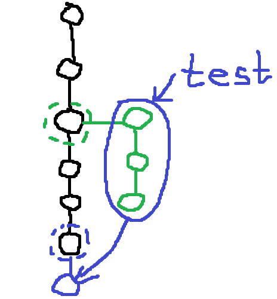

### Создание и переключение между ветками

Ветки используются повсеместно и позволяют разделить разработку или тестирования, с последующим слиянием.

Основные команды:  
- `git branch` - информация о текущей ветке с которой ведется работа.  
- `git branch -a` - просмотр всех существующих веток.  
- `git branch test` - создание новой ветки _test_ в данном коммите. При этом ветка существует пока лишь в локальном репозитории.  
- `git checkout test` - переход в ветку _test_. Позваоляет так же переключатся между коммитами и тегами.
- `git checkout -b test` - создание новой ветки _test_ с переходом в нее. Аналогично:  
`git branch test` + `git checkout test`  
- `git merge test` - слияние текущей ветки с веткой _test_. При этом создастся новая ревизия, фиксирующая слияния как отдельный коммит.  

