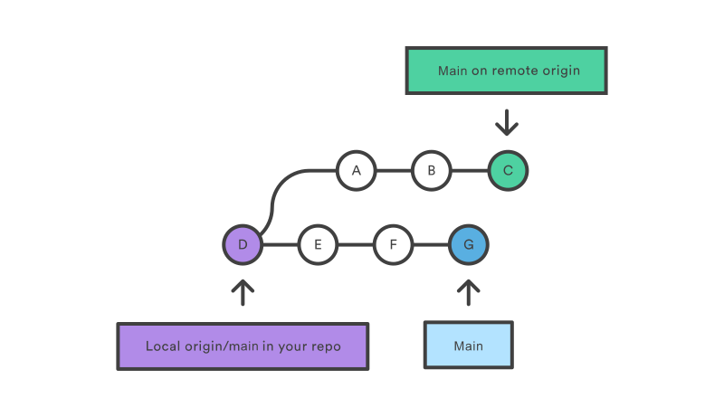
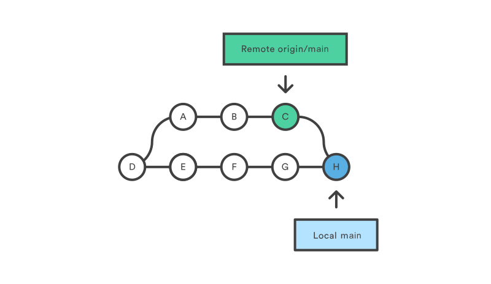

### Синхронизация с удаленным репозиторием

`git pull` - используется для извлечения и загрузки содержимого из удаленного репозитория и немедленного обновления  
локального репозитория этим содержимым. Представляет собой комбинацию двух других команд:  
- `git fetch` - загружает удаленное содержимое, но не обновляет рабочее состояние локального репозитория, оставляя текущую работу нетронутой.  
В то время как `git pull` - она загружает удаленное содержимое для активной локальной ветки и сразу выполняет команду `git merge`,  
создавая коммит слияния для нового удаленного содержимого.
- `git merge` - выполняет слияние воедино разветвленную историю.

### Пример git pull
Сначала команда `git pull` запускает команду `git fetch` для загрузки содержимого из указанного удаленного репозитория.  
Затем выполняется команда `git merge`, объединяющая ссылки и указатели удаленного содержимого в новый локальный коммит слияния.  
Предположим, у нас есть репозиторий с главной веткой _**main**_ и удаленный репозиторий _**origin**_:

В этом сценарии команда `git pull` загрузит все изменения, начиная с того места, где разошлись локальная и главная ветки.  

В данном примере это точка **_E_**. Команда `git pull` получит удаленные коммиты из отходящей ветки (т. е. точки **_A‑B‑C_**).  

Затем в процессе запуска команды `git pull` будет создан новый локальный коммит слияния, включающий содержимое новых удаленных коммитов из отходящей ветки.  

На вышеприведенной схеме мы видим новый коммит _**H**_. Это коммит слияния, в который входит содержимое удаленных коммитов _**A‑B‑C**_
и имеет общее сообщение в журнале.  

Этот пример демонстрирует одну из нескольких стратегий слияния с помощью команды `git pull`.  

Чтобы сделать перебазирование, а не коммит слитого содержимого, укажите для команды `git pull` параметр `--rebase`.  

В следующем примере демонстрируется, как работает перебазирование с помощью команды `git pull`.

Предположим, что мы находимся в начальной точке нашей первой схемы и выполнили команду `git pull --rebase`.

  

На этой схеме видно, что при перебазировании с помощью команды `pull` не был создан новый коммит _**H**_.  

Вместо этого удаленные коммиты _**A‑B‑C**_ были скопированы и добавлены в историю в локальной ветке _**origin/main**_ перед  
локальными коммитами _**E–F–G**_ с перезаписью последних.

